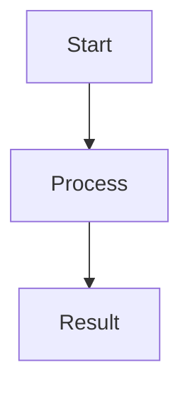

# <Document Title>

## Document Control
- Status: Draft | Review | Approved | Deprecated
- Owner: <team or person>
- Reviewers: <names or roles>
- Created: YYYY-MM-DD
- Last Updated: YYYY-MM-DD
- Version: v0.1
- Related Tickets: <links or IDs>

## Change Log
- YYYY-MM-DD | v0.1 | Initial draft
- YYYY-MM-DD | v0.2 | <what changed>

## Purpose
One short paragraph: what this document explains and why it exists.

## Scope
- In scope:
  - <item>
  - <item>
- Out of scope:
  - <item>
  - <item>

## Audience
- <role/team>
- <role/team>

## Definitions
- <Term>: <definition>
- <Term>: <definition>

## Background / Context
Describe business or technical context needed before implementation details.

## Requirements
### Functional Requirements
- FR-1: <requirement>
- FR-2: <requirement>

### Non-Functional Requirements
- NFR-1: <requirement>
- NFR-2: <requirement>

## Design / Behavior
Explain expected behavior, workflows, and key decisions.

### Flow (Optional)


## Data Model (If Applicable)
- Tables/entities:
  - <name>: <purpose>
- Key fields:
  - <field>: <meaning>
- Constraints:
  - <constraint>

## API Contract (If Applicable)
- Endpoint: `METHOD /path`
- Request:
```json
{}
```
- Response:
```json
{}
```
- Errors:
  - `400`: <reason>
  - `404`: <reason>

## Security / Permissions (If Applicable)
- Access model:
- Authorization rules:
- Audit/logging impact:

## Edge Cases
- <case>: <expected behavior>
- <case>: <expected behavior>

## Testing Strategy
- Unit tests:
- Integration tests:
- Manual verification:

## Rollout / Migration
- Backward compatibility:
- Data migration steps:
- Deployment notes:

## Risks and Mitigations
- Risk: <description>
  - Mitigation: <approach>

## Open Questions
- <question>
- <question>

## References
- <file path or URL>
- <file path or URL>
