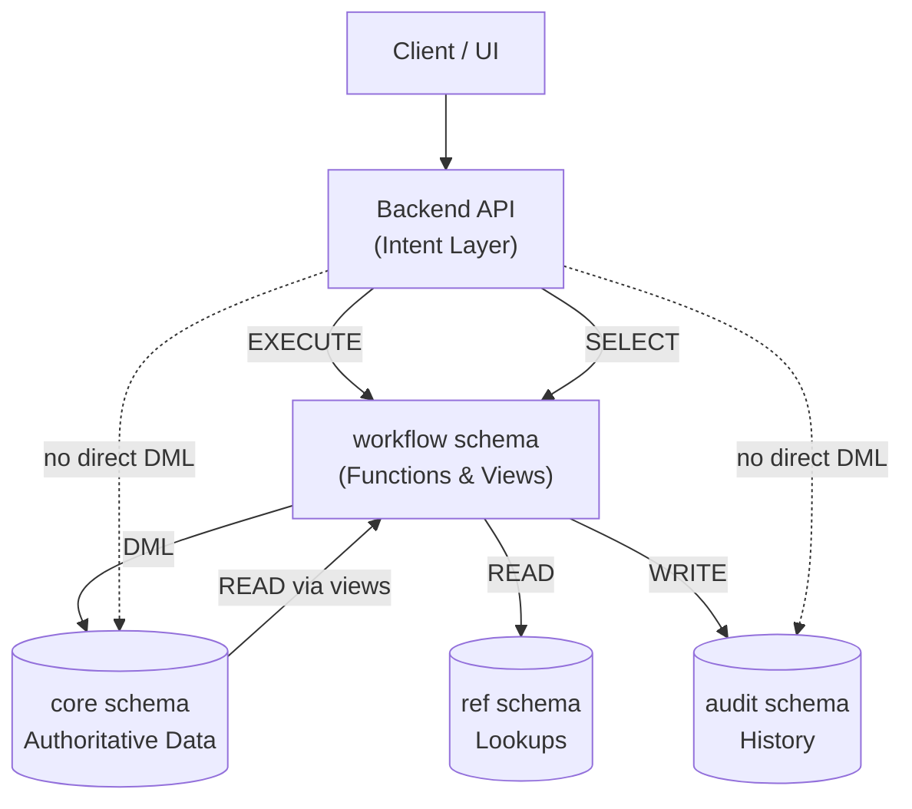

# Document & Revision Workflow  
**Backend–Database Contract (Current Implementation)**

## 1. Purpose and Scope

This document describes the **current, implemented behavior** of the document and revision workflow system as realized in the backend API and PostgreSQL database.

It is **descriptive**, not aspirational. It reflects the system *as it exists today*.

Scope includes:
- document, revision, and file lifecycle
- workflow enforcement
- database security and access model
- audit and traceability guarantees

---

## 2. Architectural Overview

The system is built around a **layered responsibility model** where correctness is enforced as close to the data as possible.

### Key Idea

> **The database is a policy engine.**  
> The API can express *intent*, but cannot violate workflow rules or data invariants.

---

## 3. High-Level Principles

### 3.1 Database-Enforced Policy

PostgreSQL enforces:
- workflow legality
- immutability of final data
- single-active / single-final constraints
- deletion and cancellation rules
- audit consistency

This is achieved via:
- `SECURITY DEFINER` functions
- triggers
- constraints
- restricted privileges

---

### 3.2 Intent-Only API

The backend:
- does **not** perform direct `INSERT/UPDATE/DELETE` on core tables
- invokes workflow functions representing domain actions
- maps database exceptions to HTTP responses

Correctness does not depend on application logic.

---

### 3.3 Least Privilege

The application role is intentionally constrained:
- no direct write access to core or audit tables
- no direct access to reference mutation
- only vetted execution paths

This limits blast radius from bugs or injection paths.

---

## 4. Schemas

### `core`
Authoritative business data:
- `doc`
- `doc_revision`
- `files`
- `files_commented`

Direct mutation by the application is forbidden.

---

### `ref`
Lookup and reference data:
- workflow statuses
- milestones
- projects, areas, units
- permissions

Read-only for the application.

---

### `workflow`
Public database contract for the API:
- workflow functions (write operations)
- workflow views (read model)

---

### `audit`
Audit and history:
- status transitions
- admin overrides
- historical revision snapshots

Audit records are written transactionally.

---

## 5. Roles and Access Model

### Defined Roles

| Role | Responsibility |
|-----|---------------|
| `db_owner` | Schema ownership, migrations |
| `db_service` | Owner of workflow functions |
| `app_user` | Backend API |
| `db_admin` | Manual intervention |
| `db_batch` | Reserved for batch jobs |

---

### Application Role (`app_user`)

Capabilities:
- `EXECUTE` on workflow functions
- `SELECT` on workflow views

Restrictions:
- no direct DML on `core`
- no direct access to `audit`
- no mutation of `ref`

---

## 6. Core Data Model

### Documents (`core.doc`)

Represents the aggregate root.

Responsibilities:
- owns revisions
- maintains `rev_current_id` and `rev_actual_id`
- supports logical deletion via `voided`

---

### Revisions (`core.doc_revision`)

Represents a single lifecycle instance.

Characteristics:
- status-driven workflow
- immutable once final
- superseded by later revisions
- never physically deleted

Cancellation is represented by `canceled_date`.

---

### Files

- Files are attached to revisions.
- Commented files are attached to primary files.
- File mutation depends on revision state.

---

## 7. Workflow Model

### Status-Driven Workflow

Workflow behavior is defined in `ref.doc_rev_statuses`.

Key attributes:
- `start`
- `final`
- `next_rev_status_id`
- `revertible`
- `editable`

There may be multiple intermediate states.

---

### Transition Rules

The database enforces:
- forward transitions only via `next_rev_status_id`
- backward transitions only when `revertible = true`
- no transitions on superseded revisions
- final revisions are immutable (except override)

Illegal transitions raise exceptions.

---

### Active / Final Constraints

Per document:
- only one non-final, non-canceled revision may exist
- only one non-superseded final revision may exist

---

### File Requirement

Transition into any non-start status requires at least one file.

---

## 8. Deletion and Cancellation

### Revisions
- physical deletion is forbidden
- cancellation sets `canceled_date`
- cancel resets `rev_current_id` to `rev_actual_id`

---

### Documents
- hard delete allowed only if exactly one start-status revision exists
- otherwise document is voided
- documents with final revisions cannot be deleted

---

## 9. Workflow Functions

All domain mutations occur through workflow functions:
- document creation/update
- revision creation/transition/cancellation
- admin overrides
- file and comment operations

Functions are:
- `SECURITY DEFINER`
- explicit `search_path`
- transactional

---

## 10. Read Model

The API reads exclusively via:
- `workflow.v_documents`
- `workflow.v_document_revisions`
- `workflow.v_files`

Views:
- hide internal columns
- expose derived workflow phase
- filter voided data

---

## 11. Audit and Traceability

Audit captures:
- all status transitions
- cancellations
- admin overrides
- historical snapshots

Audit writes occur in the same transaction as the change.

---

## 12. Responsibility Split

### API
- validate request shape
- enforce permissions
- express intent
- map DB errors
- read via views

### Database
- enforce invariants
- manage transitions and side effects
- guarantee consistency and auditability
- protect data under concurrency

---

## 13. Closing Note

This document reflects the **current system behavior**.

Any divergence between code and this document should be treated as:
- a documentation defect, or
- an unintended behavior change

Both require explicit review.
