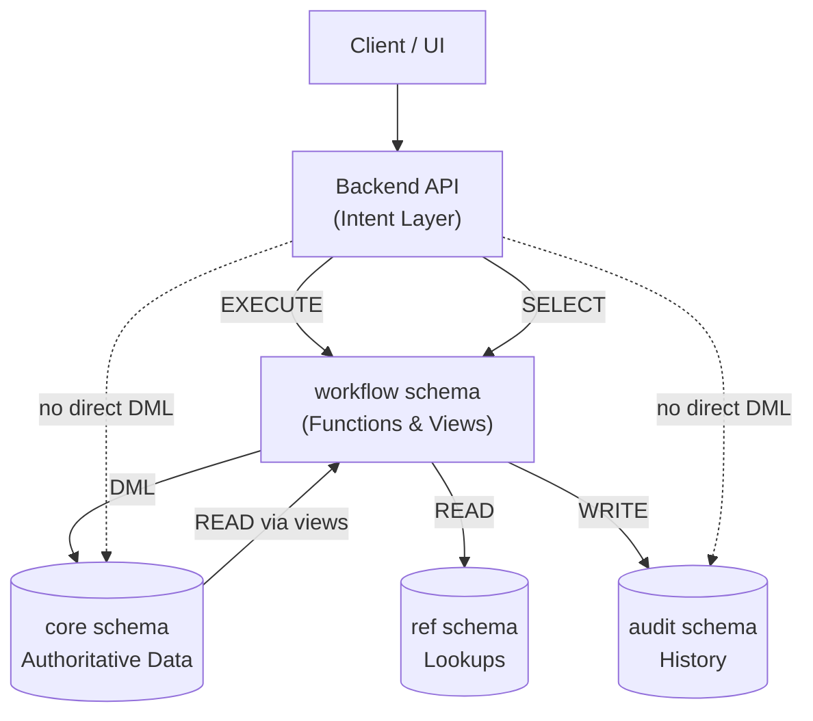

# Document & Revision Workflow  
**Backend–Database Contract (Current Implementation)**

## Document Control
- Status: Approved
- Owner: Backend and Database Team
- Reviewers: API maintainers
- Created: 2026-02-06
- Last Updated: 2026-03-26
- Version: v2.8

## Change Log
- 2026-03-26 | v2.8 | Updated the document-revisions read contract so standard list responses exclude canceled and superseded rows by default, while explicit query flags may include those rows through workflow views.
- 2026-03-25 | v2.5 | Added database-backed overview-transition creation from a current final revision, made `rev_code_id` immutable after revision creation, defaulted initial document revisions to the `revision_overview.start` step when omitted, updated revision-code uniqueness so superseded revisions behave like canceled revisions for code reuse and active-conflict checks, added a dedicated supersede workflow that replaces the current non-final revision with a new row carrying the same `rev_code_id` and the workflow start status, removed the public generic revision-create API path, revoked `app_user` access to generic revision creation, and made document update reject `rev_actual_id`/`rev_current_id` because revision pointers are workflow-managed only.
- 2026-03-20 | v1.9 | Clarified the current repository policy for revision-code changes: supported safety guarantees apply to clean bootstrap and reseed only, the database is recreated from `ci/init/` instead of migrated in place, published `rev_code_id` identities must remain stable across that bootstrap flow, `ref.revision_overview` remains reference configuration, and normal revision updates may still change `core.doc_revision.rev_code_id` through `workflow.update_revision(...)` without a dedicated overview-transition API; also defined `doc_rev_statuses.revertible` precisely as unique immediate-predecessor rollback via reverse `next_rev_status_id`, made `revision_overview` connectivity explicit as one connected `start=true` to final path, and synchronized lifecycle invariants with the current SQL schema for terminal nullability, final-step locking, cycle/self-reference prevention, single start/final semantics, and the descriptive-only role of `percentage`.
- 2026-03-18 | v1.4 | Clarified this document's scope as the backend/database enforcement contract beneath the new application-level authorization policy.
- 2026-03-04 | v1.3 | Clarified that API read SQL must target `workflow.v_*` views only and documented the repository static guard for this contract.
- 2026-02-20 | v1.2 | Added mandatory core-table audit metadata requirement, synchronized skill fallback reference, and added missing `core.written_comments` to authoritative `core` table inventory
- 2026-02-06 | v1.1 | Established initial approved backend-database contract baseline

## Purpose
Define the enforced backend-database contract for document and revision lifecycle behavior.

Business-policy source of truth:
- `documentation/application_authorization_policy.md` defines who is allowed to perform business actions.
- This document defines how API and database layers must enforce those policy decisions.

## Scope
- In scope:
  - Workflow enforcement boundaries between API and database.
  - Security, grants, and audit guarantees.
  - Data model and transition invariants.
- Out of scope:
  - UI interaction and presentation logic.
  - Non-workflow domain modules.

## Design / Behavior
This document is the authoritative implementation contract. Numbered sections below provide enforceable architecture and behavior expectations.

## 1. Purpose and Scope

This document describes the **current, implemented behavior** of the document and revision workflow system as realized in the backend API and PostgreSQL database.

It is **descriptive**, not aspirational. It reflects the system *as it exists today*.

Scope includes:
- document, revision, and file lifecycle
- workflow enforcement
- database security and access model
- audit and traceability guarantees

---

## 2. Architectural Overview

The system is built around a **layered responsibility model** where correctness is enforced as close to the data as possible.

### Key Idea

> **The database is a policy engine.**  
> The API can express *intent*, but cannot violate workflow rules or data invariants.

---

## 3. High-Level Principles

### 3.1 Database-Enforced Policy

PostgreSQL enforces:
- workflow legality
- immutability of final data
- single-active / single-final constraints
- deletion and cancellation rules
- audit consistency

This is achieved via:
- `SECURITY DEFINER` functions
- triggers
- constraints
- restricted privileges

---

### 3.2 Intent-Only API

The backend:
- does **not** perform direct `INSERT/UPDATE/DELETE` on core tables
- invokes workflow functions representing domain actions
- performs read-side SQL through `workflow.v_*` views rather than `core`, `ref`, `audit`, or non-view `workflow.*` relations
- maps database exceptions to HTTP responses

Correctness does not depend on application logic.

---

### 3.3 Least Privilege

The application role is intentionally constrained:
- no direct write access to core or audit tables
- no direct access to reference mutation
- only vetted execution paths

This limits blast radius from bugs or injection paths.

---

## 4. Schemas

### `core`
Authoritative business data:
- `doc`
- `doc_revision`
- `files`
- `files_commented`
- `written_comments`
- `distribution_list`
- `distribution_list_content`
- `notifications`
- `notification_targets`
- `notification_recipients`

Direct mutation by the application is forbidden.

Mandatory audit metadata on every `core` table:
- `created_at TIMESTAMPTZ DEFAULT CURRENT_TIMESTAMP NOT NULL`
- `updated_at TIMESTAMPTZ DEFAULT CURRENT_TIMESTAMP NOT NULL`
- `created_by SMALLINT REFERENCES ref.users(user_id)`
- `updated_by SMALLINT REFERENCES ref.users(user_id)`

---

### `ref`
Lookup and reference data:
- workflow statuses
- milestones
- projects, areas, units
- permissions

Read-only for the application.

---

### `workflow`
Public database contract for the API:
- workflow functions (write operations)
- workflow views (read model)

---

### `audit`
Audit and history:
- status transitions
- admin overrides
- historical revision snapshots

Audit records are written transactionally.

---

## 5. Roles and Access Model

### Defined Roles

| Role | Responsibility |
|-----|---------------|
| `db_owner` | Schema ownership, migrations |
| `db_service` | Owner of workflow functions |
| `app_user` | Backend API |
| `db_admin` | Manual intervention |
| `db_batch` | Reserved for batch jobs |

---

### Application Role (`app_user`)

Capabilities:
- `EXECUTE` on workflow functions
- `SELECT` on workflow views

Restrictions:
- no direct DML on `core`
- no direct access to `audit`
- no mutation of `ref`

Repository enforcement:
- API Python read SQL is statically checked to ensure `FROM`/`JOIN` targets use `workflow.v_*` only, with a small explicit allowlist for workflow mutation functions that return rows.

---

## 6. Core Data Model

### Documents (`core.doc`)

Represents the aggregate root.

Responsibilities:
- owns revisions
- maintains `rev_current_id` and `rev_actual_id`
- supports logical deletion via `voided`

`rev_current_id` and `rev_actual_id` are workflow-managed pointers. They must be changed only by document/revision creation, status transitions, supersede, overview transition, cancel, or delete workflow functions, not by generic document update.

---

### Revisions (`core.doc_revision`)

Represents a single lifecycle instance.

Characteristics:
- status-driven workflow
- immutable once final
- superseded by later revisions
- never physically deleted

Cancellation is represented by `canceled_date`.

---

### Files

- Files are attached to revisions.
- Commented files are attached to primary files.
- File mutation depends on revision state.

---

## 7. Workflow Model

### Status-Driven Workflow

Workflow behavior is defined in `ref.doc_rev_statuses`.

Key attributes:
- `start`
- `final`
- `next_rev_status_id`
- `revertible`
- `editable`

The database enforces:
- no self-reference
- no cycles
- only one `start = true` status
- only one terminal/final status
- final statuses must have `next_rev_status_id IS NULL`
- final statuses must not be editable or revertible
- each non-start status has at most one immediate predecessor

Backward-transition semantics:
- `revertible = true` allows movement only to the unique immediate predecessor status
- that predecessor is the unique row where `next_rev_status_id = current rev_status_id`
- `start = true` statuses cannot move backward
- if a non-start revertible status has no predecessor, the transition fails
- ambiguous predecessor graphs are forbidden structurally

There may be multiple intermediate states.

---

### Revision code lifecycle

Revision-code behavior is defined in `ref.revision_overview`.

Required lifecycle attributes:
- `start`
- `final`
- `next_rev_code_id`
- `percentage`

The database enforces:
- no self-reference
- no cycles
- only one `start = true` step
- only one terminal/final step
- final steps must have `next_rev_code_id IS NULL`
- non-final steps must have a single successor and at most one predecessor
- every row must belong to the single connected chain reachable from the unique `start = true` step
- disconnected rows, hidden predecessors, unreachable islands, and separate acyclic chains are forbidden

Connectivity is validated as a deferred transaction-end invariant so valid multi-row reconfiguration can occur within a transaction as long as the committed final state is one connected start-to-final path.

`percentage` is descriptive metadata only. It does not define lifecycle ordering.

Current application contract:
- `ref.revision_overview` is reference/lifecycle configuration data.
- The repository ships `workflow.create_overview_transition_revision(...)` and `POST /api/v1/documents/revisions/{rev_id}/overview-transition` for creating the next revision from a current final revision.
- The repository ships `workflow.supersede_revision(...)` and `POST /api/v1/documents/revisions/{rev_id}/supersede` for replacing the current non-final revision with a fresh row that keeps the same `rev_code_id` and resets `rev_status_id` to the workflow start status.
- The repository does not expose a public generic revision-create endpoint for existing documents; app clients must use supersede for current non-final revisions and overview transition for current final revisions.
- Normal revision updates still run through `workflow.update_revision(...)`, but they must not change `core.doc_revision.rev_code_id`.
- `workflow.create_document(...)` resolves the initial `rev_code_id` from the `revision_overview.start` row when the caller omits it.

---

### Revision code bootstrap and migration guarantees

Repository-supported bootstrap path:
- The repository ships schema initialization plus seed scripts under `ci/init/`.
- The supported repeatable setup flow is `flow_init.psql` followed by `flow_seed.sql`.
- `flow_init.psql` is intentionally re-runnable because it recreates the managed schemas before reinstalling objects.
- `flow_seed.sql` is not a standalone idempotent migration script; it assumes a freshly initialized schema set.
- Until a migration framework is introduced, repository-supported database changes are applied by dropping and recreating the database from `ci/init/`, not by shipping standalone in-place migration scripts.

Identity and foreign-key guarantees:
- `flow_seed.sql` inserts explicit `rev_code_id` values for the seeded revision-code lifecycle. Those IDs are part of the repository bootstrap contract.
- The seed currently guarantees this stable mapping:
  - `1 = IDC`
  - `2 = IFRC`
  - `3 = AFD`
  - `4 = AFC`
  - `5 = AS-BUILT`
  - `6 = INDESIGN`
- After explicit ID inserts, the seed resets the identity sequence to `MAX(rev_code_id)` so subsequent generated IDs do not collide or remap seeded values.
- `core.doc_revision.rev_code_id` is protected by a foreign key to `ref.revision_overview(rev_code_id)`, so downstream revision rows cannot point to missing revision codes.
- Repository-supported bootstrap and workflow write paths must preserve that FK validity for future insert/update operations in recreated environments.

Migration requirement for future changes:
- If a future migration framework is introduced, any in-place migration that changes revision-code rows must preserve the published `rev_code_id` mapping above or provide an explicit data migration that updates every dependent reference safely in the same change.

---

### Transition Rules

The database enforces:
- forward transitions only via `next_rev_status_id`
- backward transitions only when `revertible = true`
- backward transitions target only the unique immediate predecessor resolved by reverse `next_rev_status_id`
- no transitions on superseded revisions
- final revisions are immutable (except override)

Illegal transitions raise exceptions.

---

### Active / Final Constraints

Per document:
- only one non-final, non-canceled, non-superseded revision may exist
- multiple non-superseded final revisions may exist only when each uses a different `rev_code_id`

---

### File Requirement

Transition into any non-start status requires at least one file.

---

## 8. Deletion and Cancellation

### Revisions
- physical deletion is forbidden
- cancellation sets `canceled_date`
- cancel resets `rev_current_id` to `rev_actual_id`
- canceled revisions are excluded from `workflow.v_document_revisions`
- standard `GET /documents/{doc_id}/revisions` responses exclude canceled and superseded rows by default
- explicit list-query flags may include canceled and/or superseded rows through the workflow read model without bypassing view-based access control
- only one non-canceled, non-superseded revision per document may use a given `rev_code_id`
- transitioning a revision to final updates `rev_actual_id` / `rev_current_id` to that revision but does not supersede other final revisions with different `rev_code_id`
- generic revision updates cannot mutate `rev_code_id` after creation
- current final revisions progress by inserting a new row through the overview-transition workflow, not by updating the final row in place

---

### Documents
- hard delete allowed only if exactly one start-status revision exists
- otherwise document is voided
- documents with final revisions cannot be deleted

---

## 9. Workflow Functions

All domain mutations occur through workflow functions:
- document creation/update
- revision creation/transition/cancellation
- admin overrides
- file and comment operations

Functions are:
- `SECURITY DEFINER`
- explicit `search_path`
- transactional

---

## 10. Read Model

The API reads exclusively via:
- `workflow.v_documents`
- `workflow.v_document_revisions`
- `workflow.v_document_revisions_all`
- `workflow.v_files`

Views:
- hide internal columns
- expose derived workflow phase
- filter voided data

---

## 11. Audit and Traceability

Audit captures:
- all status transitions
- cancellations
- admin overrides
- historical snapshots

Audit writes occur in the same transaction as the change.

---

## 12. Responsibility Split

### API
- validate request shape
- enforce permissions
- express intent
- map DB errors
- read via views

### Database
- enforce invariants
- manage transitions and side effects
- guarantee consistency and auditability
- protect data under concurrency

---

## 13. Closing Note

This document reflects the **current system behavior**.

Any divergence between code and this document should be treated as:
- a documentation defect, or
- an unintended behavior change

Both require explicit review.

## Edge Cases
- API attempts direct DML on protected schemas instead of workflow functions.
- Concurrent revision updates that test invariant enforcement.
- Cancellation and deletion requests for final or superseded revisions.

## References
- `documentation/api_interfaces.md`
- `api/routers/documents.py`
- `api/db/`
