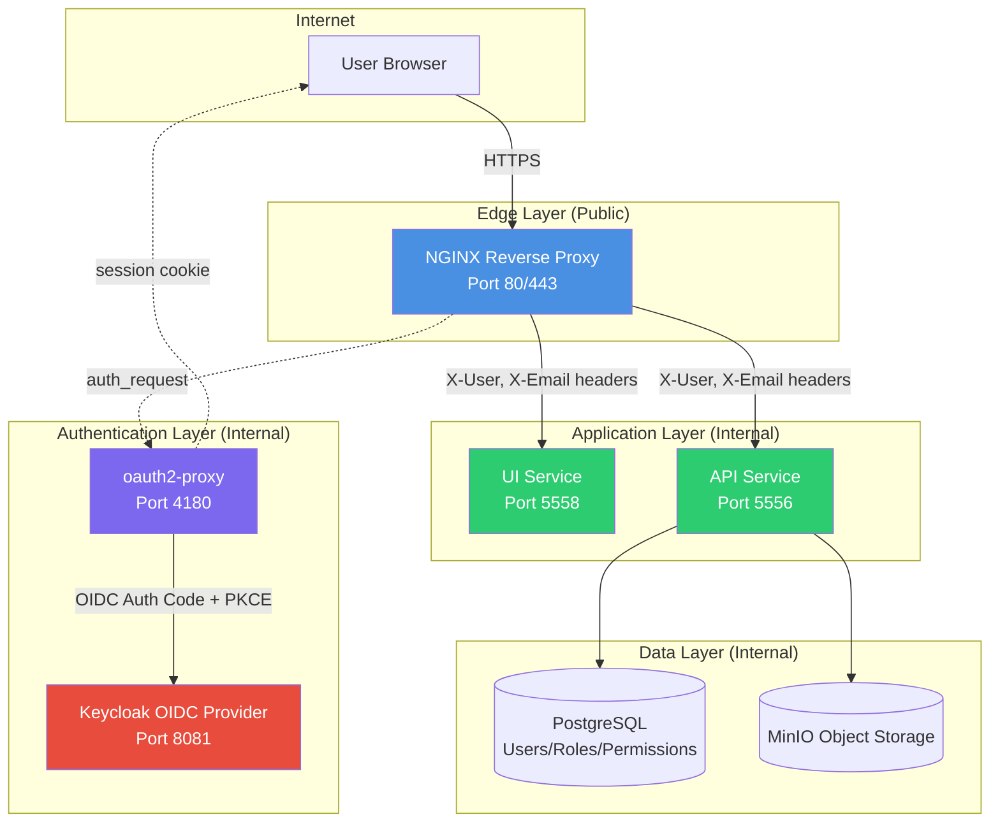
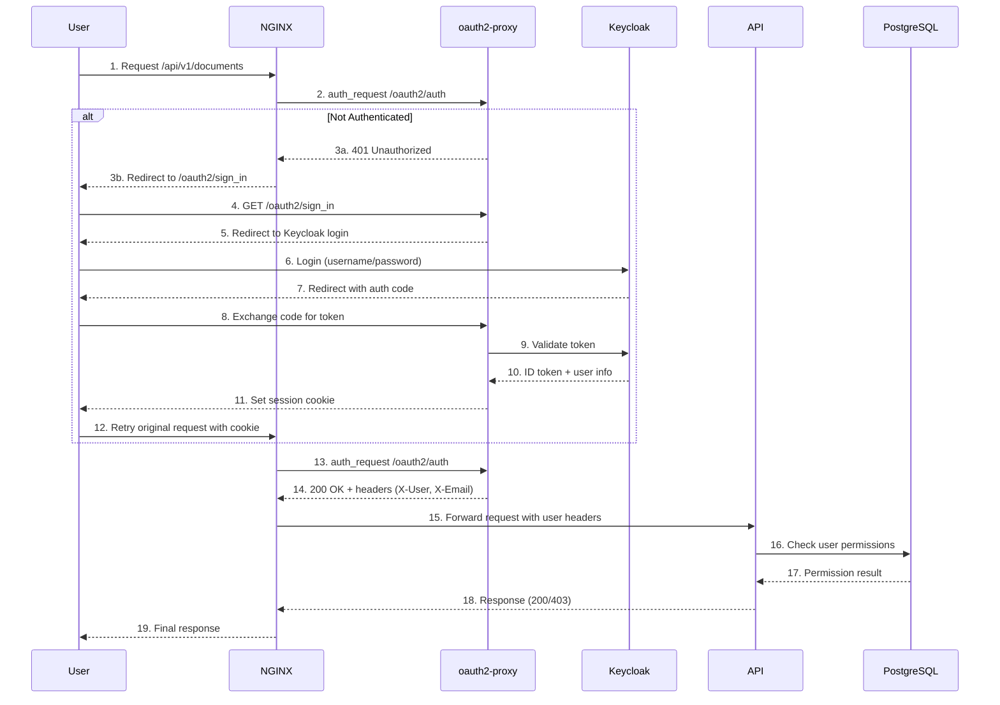
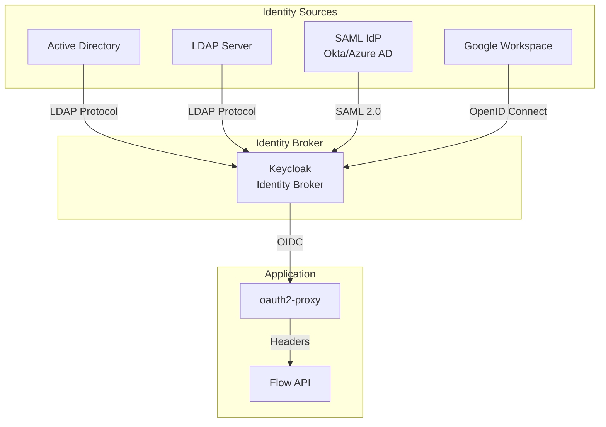
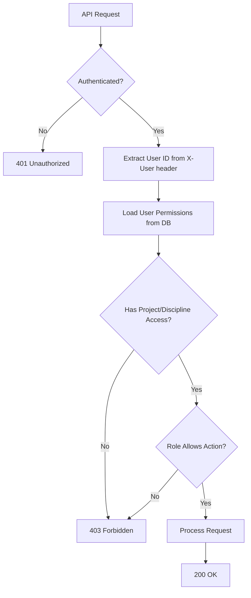

# Authentication Architecture for Flow Gen2

## Document Control
- Status: Review
- Owner: Platform and Backend Team
- Reviewers: Security and API maintainers
- Created: 2026-02-06
- Last Updated: 2026-02-06
- Version: v1.1

## Purpose
Define the target authentication and authorization architecture for Flow Gen2, including staged rollout guidance.

## Scope
- In scope:
  - Edge authentication architecture and identity provider integration.
  - Session, token, and operational security controls.
  - Rollout and migration strategies.
- Out of scope:
  - Endpoint-by-endpoint API contracts.
  - Non-authentication product workflows.

## Design / Behavior
The sections below describe layered auth architecture, implementation phases, and operational controls required for secure deployment.

## Executive Summary

Flow Gen2 employs a **layered authentication architecture** that separates concerns between edge authentication (handled by NGINX + oauth2-proxy + Keycloak) and application-level authorization (managed within the API and database). This design minimizes code changes in the API/UI while providing enterprise-grade security, scalability, and flexibility for future identity provider integrations.

**Key Principles:**
- **Zero Trust at the Edge:** All external traffic is authenticated before reaching application services
- **Separation of Concerns:** Authentication (who you are) is handled at infrastructure layer; Authorization (what you can do) is managed by application
- **Minimal Application Burden:** API and UI remain lightweight by delegating authentication to reverse proxy layer
- **Future-Ready:** Architecture supports migration from local database authentication to enterprise identity providers (AD, LDAP, SSO)

---

## Architecture Overview

### High-Level Architecture Diagram



### Authentication Flow Sequence



---

## Concrete design choices & parameters

### Password storage
- Prefer Argon2id. Starting parameters: time=2, memory=64–128 MB, parallelism=1; tune on prod-like hardware.
- If Argon2id is unavailable, use bcrypt with cost >= 12.
- Salt per user (random); never use fixed salts.

### Token strategy
- JWTs: sign with asymmetric keys (RS256 or ES256). Publish JWKS for key rotation.
- Access token lifetime: 5–15 minutes. Refresh token lifetime: days/weeks; rotate on each refresh.
- If you need immediate revocation, use opaque refresh tokens stored server-side.

### Revocation strategy
- Prefer short access token lifetimes.
- For refresh tokens, store server-side with TTL and revoke on logout.
- If JWT revocation is required, use a revocation list (e.g., Redis) with TTL.

### Key management
- Store private keys and secrets in a secret manager (Vault, AWS KMS + Secrets Manager, GCP KMS).
- Rotate keys regularly and document rollback procedure.
- Publish public keys via JWKS (OIDC discovery).

### Public and mobile clients
- Use OAuth2 Authorization Code with PKCE.

### Cookies vs storage
- Prefer Secure, HttpOnly cookies with SameSite=Strict (or Lax if required).
- If using tokens in SPAs, send via Authorization header and avoid localStorage.

### Algorithms & crypto
- Passwords: Argon2id; fallback bcrypt cost >= 12.
- JWTs: RS256 or ES256.
- Minimum key sizes: RSA >= 2048 bits (3072+ recommended for long-term).

### CSRF and CORS
- If using cookies, require CSRF protection (token or double-submit cookie).
- Restrict allowed origins for auth endpoints; document CORS policy.

### Session store
- Use Redis for sessions/blacklists (clustered if needed).
- Define TTLs and eviction policy (e.g., volatile-ttl).

## Staged Implementation Plan

## Security & operational controls (must-have checklist)

Brute-force protection and rate limiting:
- Rate limit auth endpoints (login, refresh, password reset) at the edge and provider.
- Apply progressive delays after repeated failures; consider CAPTCHA after N failed attempts.
  - NGINX: limit `/oauth2/` with `limit_req` (5 r/s, burst 10).
  - Keycloak: enable Brute Force Detection in Realm Settings → Security Defenses.

Account lockout:
- Define lockout thresholds and durations.
- Send lockout notifications and provide recovery flow.
  - Keycloak: configure in Realm Settings → Security Defenses → Brute Force Detection.
  - Suggested defaults: 5 failures → 5 min lockout; 10 failures → 30 min lockout; notify user on lockout.

MFA:
- Prefer TOTP or WebAuthn; use SMS only as a fallback.
- Document enrollment, backup codes, and recovery procedures.

Logging & privacy:
- Log success/failure events and reasons without storing secrets or full tokens.
- Use structured logs with anonymized identifiers where possible.
  - Keycloak: enable event logging for LOGIN/LOGIN_ERROR and redact sensitive fields.
  - oauth2-proxy: log request IDs and user IDs only; avoid logging cookies or tokens.

Monitoring & alerting:
- Metrics: auth success/fail rates, refresh rate, token issuance per client, latency, revocation counts.
- Alerts: spikes in failed logins, abnormal revocations, JWKS signature errors, key rotation failures.

Incident response/runbook:
- Steps: revoke keys, rotate secrets, block abusive IPs/users, notify users.
- Define on-call contact/owner and escalation path.

## Rollout & migration plan (staged, with fallbacks)

Stage 0 — Design + infra:
- Create JWKS and store private keys in KMS/Secrets Manager.
- Create service accounts and verify access scopes.
- Test key issuance, rotation, and rollback in staging.

Stage 1 — Implement auth service (internal only):
- Deploy auth stack behind feature flags.
- Allow opt-in for internal users only.
- Validate auth flows, session handling, and logs.

Stage 2 — Integrate with API gateway & frontend:
- Enable gateway protection via feature flag.
- Update frontend to support login/logout/refresh flows.
- Run internal QA and security checks.

Stage 3 — Canary rollout:
- Enable for a small percentage of users.
- Monitor auth success/fail rates, latency, and error budgets.
- Gradually increase traffic while watching alerts.

Stage 4 — Full rollout:
- Enable for all users.
- Deprecate legacy flows and remove old endpoints.

Migration notes:
- If migrating password hashes, re-hash on first login or provide a migration route.
- Backfill new fields carefully and keep backward compatibility for a defined window.

## Backwards compatibility & API contract

API contract:
- Publish explicit auth endpoint specifications (OpenAPI or equivalent) with request/response schemas.
- Include status codes, error codes, and example responses for each endpoint.
- Define header requirements (e.g., Authorization, cookie usage) per endpoint.

Versioning policy:
- Version auth endpoints under `/api/v1/auth` and only introduce breaking changes in `/api/v2`.
- Provide a deprecation window and migration guide for older versions.
- Announce deprecations and removal dates in release notes.

## Compliance, privacy, and data retention

Retention policy:
- Define retention periods for auth logs, session records, and refresh tokens.
- Minimize PII in logs; store only what is required for security and audit.

Compliance and data location:
- Identify applicable regulations (e.g., GDPR, HIPAA) and required controls.
- Document data residency requirements and where identity data is stored.

User data rights:
- Provide opt-out or account deletion procedures.
- Document how to export or delete user data on request.

### Phase 1: Database-Based Authentication (Weeks 1-2)
**Goal:** Establish basic authentication infrastructure with local user management

**Components:**
- ✅ PostgreSQL schema with `users`, `roles`, `person` tables (already exists)
- ✅ Keycloak running in development mode
- ✅ oauth2-proxy configured for OIDC
- ✅ NGINX with auth_request directive

**Implementation Steps:**
1. **User Provisioning Script**
   - Create `/scripts/sync_users_to_keycloak.py`
   - Reads from PostgreSQL `flow.users` and `flow.person` tables
   - Synchronizes users to Keycloak realm via Admin API
   - Runs periodically (cron job or systemd timer)
   - Handles password hashing and initial credential setup

2. **Keycloak Configuration**
   - Realm: `flow-local` (for dev) or `flow-production` (for prod)
   - Client: `flow-oauth2-proxy` with confidential access
   - Initial users from database export
   - Password policy enforcement

3. **Testing & Validation**
   - Verify login flow with test users
   - Test session management and logout
   - Validate user header propagation to API/UI

**Deliverables:**
- User sync script with documentation
- Keycloak realm export template
- Updated docker-compose.yml with sync job
- Testing checklist and validation procedures

**Migration Path:**
```
PostgreSQL Users (Source of Truth)
    ↓ (sync script runs hourly)
Keycloak Users (Authentication)
    ↓ (OIDC flow)
Application Access
```

---

### Phase 2: Enhanced Security & Session Management (Weeks 3-4)
**Goal:** Harden security, improve session handling, add audit logging

**Enhancements:**
1. **TLS/HTTPS Enforcement**
   - Add Let's Encrypt certificate automation (certbot)
   - NGINX SSL termination with modern cipher suites
   - HSTS headers and secure cookie flags
   - HTTP to HTTPS redirect

2. **Session Management**
   - Configure session timeout policies (default: 8 hours)
   - Implement sliding session windows
   - Add "Remember Me" functionality (optional)
   - Session revocation on password change

3. **Audit Logging**
   - Log authentication events (login/logout/failed attempts)
   - Track API access with user attribution
   - Store audit logs in PostgreSQL audit schema
   - Implement log rotation and retention policies

4. **Defense in Depth**
   - Add API-level header validation
   - Implement rate limiting (fail2ban or NGINX limit_req)
   - Add CSRF protection for state-changing operations
   - Input validation and sanitization

**Configuration Updates:**
```nginx
# Enhanced NGINX security headers
add_header Strict-Transport-Security "max-age=31536000; includeSubDomains" always;
add_header X-Frame-Options "SAMEORIGIN" always;
add_header X-Content-Type-Options "nosniff" always;
add_header X-XSS-Protection "1; mode=block" always;
add_header Referrer-Policy "strict-origin-when-cross-origin" always;
```

---

### Phase 3: External Identity Provider Integration (Weeks 5-8)
**Goal:** Enable integration with enterprise identity providers (AD, LDAP, SSO)

**Architecture Enhancement:**



**Integration Options:**

1. **Active Directory (LDAP)**
   - Configure Keycloak User Federation
   - Map AD groups to Keycloak roles
   - Sync user attributes (email, display name, department)
   - Support for nested group memberships

2. **SAML 2.0 Providers (Azure AD, Okta)**
   - Add SAML Identity Provider in Keycloak
   - Configure attribute mappings
   - Test SSO flow with corporate accounts

3. **Social Providers (Google, GitHub, Microsoft)**
   - Enable social login for external collaborators
   - Restrict by email domain whitelist
   - Map social accounts to internal user records

**User Mapping Strategy:**
- **Primary Key:** Email address (must be unique across providers)
- **Fallback:** Username from external provider
- **Attribute Sync:** First name, last name, department, manager
- **Role Assignment:** Based on AD group membership or manual provisioning

**Database Schema Extension:**
```sql
ALTER TABLE flow.users ADD COLUMN external_id VARCHAR(255);
ALTER TABLE flow.users ADD COLUMN identity_provider VARCHAR(50);
ALTER TABLE flow.users ADD COLUMN last_login_at TIMESTAMPTZ;
ALTER TABLE flow.users
    ADD CONSTRAINT users_identity_provider_external_id_uniq
    UNIQUE (identity_provider, external_id);

CREATE TABLE flow.identity_provider_mappings (
    mapping_id SERIAL,
    user_id SMALLINT REFERENCES flow.users(user_id),
    provider_name VARCHAR(50) NOT NULL,
    external_user_id VARCHAR(255) NOT NULL,
    attributes JSONB,
    created_at TIMESTAMPTZ DEFAULT CURRENT_TIMESTAMP,
    updated_at TIMESTAMPTZ DEFAULT CURRENT_TIMESTAMP,
    UNIQUE (provider_name, external_user_id),
    PRIMARY KEY (mapping_id)
);

CREATE INDEX idx_identity_provider_mappings_user_id
    ON flow.identity_provider_mappings(user_id);
```

---

### Phase 4: Advanced Authorization & Multi-Tenancy (Weeks 9-12)
**Goal:** Implement fine-grained access control and support multi-project isolation

**Features:**

1. **Role-Based Access Control (RBAC)**
   - Predefined roles: Admin, Coordinator, Engineer, Viewer
   - Permission matrix per resource type
   - Hierarchical role inheritance

2. **Attribute-Based Access Control (ABAC)**
   - Project-level isolation (users can only access assigned projects)
   - Discipline-level filtering
   - Document lifecycle-based permissions (draft vs. published)

3. **Permission Model:**
```sql
-- Existing permissions table structure (already in DB)
-- Supports project_id and discipline_id scoping
-- API enforces permissions based on user_id + resource scope
```

4. **API Authorization Middleware**
```python
# Pseudocode for API authorization
def check_permission(user_id, resource_type, resource_id, action):
    # 1. Extract user from X-User header (set by NGINX)
    # 2. Query permissions table for user's access scope
    # 3. Verify resource belongs to allowed project/discipline
    # 4. Check if user's role permits the action (read/write/delete)
    # 5. Return 200 (allow) or 403 (deny)
```

5. **Group-Based Permissions (Future)**
   - Map AD/LDAP groups to Flow roles
   - Automatic permission assignment on login
   - Support for dynamic group membership changes

**Permission Evaluation Flow:**


---

## Application-Level Access Management

### Current Database Schema
Flow Gen2 already has a robust authorization schema:

**Tables:**
- `flow.roles` - User roles (Admin, Engineer, Viewer, etc.)
- `flow.person` - Person entities with profile information
- `flow.users` - User accounts linked to persons and roles
- `flow.permissions` - Scoped access grants (project + discipline combinations)

**Permission Enforcement:**
```python
# API validates permissions before data access
# Example: GET /api/v1/documents?project_id=3
# 1. Extract user from X-User header
# 2. Query: SELECT * FROM permissions WHERE user_id=? AND project_id=3
# 3. If no matching permission → 403 Forbidden
# 4. If permission exists → filter results to allowed disciplines
```

### Access Control Strategies

**Strategy 1: Explicit Grants (Current)**
- Admins explicitly assign users to projects/disciplines
- Fine-grained control but higher maintenance overhead
- Best for: Controlled environments, compliance requirements

**Strategy 2: Default Allow with Exceptions**
- All authenticated users get read access to public projects
- Write access requires explicit permissions
- Best for: Collaborative environments, open-source projects

**Strategy 3: Group-Based Inheritance**
- Users inherit permissions from AD/LDAP groups
- Keycloak maps groups to Flow roles
- Best for: Enterprise environments with existing group structures

---

## Integration with External Systems

### Active Directory / LDAP Integration

**Use Case:** Enterprise deployment where users are managed in Windows AD

**Configuration:**
1. **Keycloak LDAP User Federation**
   ```properties
   Connection URL: ldaps://ad.company.com:636
   # Use LDAPS or LDAP with StartTLS in production. Disable plaintext ldap:// on all production systems.
   Bind DN: CN=ServiceAccount,OU=ServiceAccounts,DC=company,DC=com
   User DN: OU=Users,DC=company,DC=com
   Username LDAP attribute: sAMAccountName
   RDN LDAP attribute: cn
   UUID LDAP attribute: objectGUID
   ```

2. **Group Mapping**
   ```
   AD Group: CN=FlowAdmins,OU=Groups,DC=company,DC=com
   → Keycloak Role: flow-admin
   → Flow Database Role: Admin (role_id=1)
   
   AD Group: CN=FlowEngineers,OU=Groups,DC=company,DC=com
   → Keycloak Role: flow-engineer
   → Flow Database Role: Engineer (role_id=2)
   ```

3. **Sync Strategy**
   - **Full Sync:** Daily at 2 AM (import all users from AD)
   - **Changed Users Sync:** Every 30 minutes (only updated users)
   - **On-Demand Sync:** When user logs in for first time

4. **Permission Assignment**
   - **Option A:** Manual assignment in Flow UI (higher control)
   - **Option B:** Auto-assign based on AD group + department attribute
   - **Option C:** Default read-only access, explicit writes

### SAML 2.0 Integration (Azure AD, Okta)

**Use Case:** Organizations using cloud identity providers

**Keycloak Configuration:**
```xml
<!-- SAML Identity Provider -->
<Identity Provider>
  <Alias>azure-ad</Alias>
  <Provider>saml</Provider>
  <Single SignOn Service URL>https://login.microsoftonline.com/{tenant}/saml2</Single SignOn Service URL>
  <Single Logout Service URL>https://login.microsoftonline.com/{tenant}/saml2</Single Logout Service URL>
  <NameID Policy Format>urn:oasis:names:tc:SAML:1.1:nameid-format:emailAddress</NameID Policy Format>
  <Attribute Mappings>
    <Email>http://schemas.xmlsoap.org/ws/2005/05/identity/claims/emailaddress</Email>
    <FirstName>http://schemas.xmlsoap.org/ws/2005/05/identity/claims/givenname</FirstName>
    <LastName>http://schemas.xmlsoap.org/ws/2005/05/identity/claims/surname</LastName>
    <Groups>http://schemas.microsoft.com/ws/2008/06/identity/claims/groups</Groups>
  </Attribute Mappings>
</Identity Provider>
```

**Benefits:**
- Single sign-on across organization
- Centralized user management
- MFA enforcement by IdP
- Automatic user provisioning/deprovisioning

---

## Security Considerations

### Best Practices

1. **Network Segmentation**
   - Only NGINX exposed to internet (port 80/443)
   - API, UI, Keycloak, PostgreSQL on internal network
   - Use Docker networks or VPC isolation in cloud

2. **Secret Management**
   - Never commit secrets to Git
   - Use environment variables or secret management tools (Vault, AWS Secrets Manager)
   - Rotate Keycloak client secrets quarterly
   - Use strong, randomly generated OAUTH2_PROXY_COOKIE_SECRET (32+ bytes)

3. **Password Policies**
   - Minimum 12 characters
   - Require uppercase, lowercase, number, special character
   - Prevent password reuse (last 5 passwords)
   - Force password reset after 90 days
   - Lock account after 5 failed login attempts

4. **Token Security**
   - Access tokens default validity: 5 minutes (recommended starting point; tune based on UX, performance, and security requirements — typical ranges are 15–60 minutes)
   - Refresh tokens default validity: 8 hours (starting point; adjust based on risk profile, session duration expectations, and compliance needs)
   - ID tokens include user claims (email, roles)
   - Token signing with RS256 algorithm

5. **Session Security**
   - HTTP-only cookies (prevent XSS)
   - Secure flag in production (HTTPS only)
   - SameSite=Lax to prevent CSRF
   - Session timeout after 8 hours of inactivity

### Threat Model & Mitigations

| Threat | Impact | Mitigation |
|--------|--------|------------|
| Credential theft | High | MFA, password policies, account lockout |
| Session hijacking | High | Secure cookies, HTTPS only, short timeouts |
| CSRF attacks | Medium | SameSite cookies, CSRF tokens for mutations |
| SQL injection | High | Parameterized queries, ORM usage |
| XSS attacks | Medium | Content Security Policy, input sanitization |
| DDoS | Medium | Rate limiting, CDN, auto-scaling |
| Man-in-the-middle | High | TLS 1.3, certificate pinning |
| Privilege escalation | High | Principle of least privilege, audit logging |

---

## Operational Guidance

### Deployment Checklist

**Pre-Production:**
- [ ] Review Keycloak realm configuration
- [ ] Test user provisioning/deprovisioning
- [ ] Validate HTTPS certificates
- [ ] Configure session timeouts
- [ ] Enable audit logging
- [ ] Set up monitoring and alerts
- [ ] Document disaster recovery procedures
- [ ] Train support team on password reset process

**Production:**
- [ ] Use production-grade database (not dev mode)
- [ ] Enable Keycloak clustering (HA)
- [ ] Configure backup for Keycloak database
- [ ] Set up log aggregation (ELK, Splunk)
- [ ] Implement secret rotation procedures
- [ ] Enable security scanning (OWASP ZAP, Burp)
- [ ] Perform penetration testing
- [ ] Create incident response plan

### Monitoring & Alerting

**Key Metrics:**
- Authentication success/failure rate
- Session duration distribution
- API request latency by endpoint
- Active concurrent sessions
- Failed login attempts per user
- Token refresh rate

**Alerts:**
- 🔴 Critical: Keycloak service down, database unreachable
- 🟠 Warning: High failed login rate (> 10% of attempts)
- 🟡 Info: User sync job failures, certificate expiring in 30 days

### Maintenance Tasks

**Daily:**
- Review audit logs for anomalies
- Monitor system health metrics

**Weekly:**
- Review user access reports
- Check for abandoned sessions

**Monthly:**
- Review and update user permissions
- Audit role assignments
- Test backup restoration

**Quarterly:**
- Rotate secrets and certificates
- Security patch updates
- Access control audit
- Disaster recovery drill

---

## Migration Scenarios

### Scenario 1: From Local DB to Active Directory

**Timeline:** 2-3 weeks

**Steps:**
1. Week 1: Configure Keycloak LDAP federation
2. Week 1: Test AD authentication with pilot users
3. Week 2: Map AD groups to Flow roles
4. Week 2: Migrate production users to AD authentication
5. Week 3: Decommission local user sync script
6. Week 3: Update documentation and train admins

**Rollback Plan:**
- Keep local Keycloak users as backup
- Maintain parallel authentication for 1 month
- Document manual user creation process

### Scenario 2: From Keycloak to Okta/Azure AD SAML

**Timeline:** 3-4 weeks

**Steps:**
1. Week 1: Set up SAML IdP in Keycloak
2. Week 1-2: Configure attribute mappings and test
3. Week 2-3: Pilot with subset of users
4. Week 3: Migrate remaining users
5. Week 4: Monitor and optimize

---

## Edge Cases
- Identity provider unavailable during active login flows.
- Clock skew causing token validation failures.
- Header spoofing attempts that bypass trusted proxy assumptions.
- Session revocation lag across distributed services.

## Appendix

### Environment Variables Reference

```bash
# Keycloak
KEYCLOAK_ADMIN=admin
KEYCLOAK_ADMIN_PASSWORD=<generated-32-char-password>  # Keycloak admin password; follow password policy (example uses 32 chars)
KEYCLOAK_HOSTNAME=auth.company.com
KEYCLOAK_PORT=8081
KC_DB=postgres  # Use external DB for production
KC_DB_URL=jdbc:postgresql://postgres:5432/keycloak?sslmode=require  # For production, enable TLS on PostgreSQL and require SSL in the JDBC URL

# oauth2-proxy
OAUTH2_PROXY_CLIENT_ID=flow-oauth2-proxy
OAUTH2_PROXY_CLIENT_SECRET=<generated-32-char-secret>  # From Keycloak client credentials
OAUTH2_PROXY_COOKIE_SECRET=<32-byte-random-base64-string>  # Generate with: openssl rand -base64 32
OAUTH2_PROXY_OIDC_ISSUER_URL=https://auth.company.com/realms/flow-production
OAUTH2_PROXY_REDIRECT_URL=https://app.company.com/oauth2/callback
OAUTH2_PROXY_EMAIL_DOMAINS=company.com  # Restrict to organization (single domain, or comma-separated list; use "*" to allow any)

# NGINX
CLIENT_MAX_BODY_SIZE=128m
SSL_CERTIFICATE=/etc/letsencrypt/live/app.company.com/fullchain.pem
SSL_CERTIFICATE_KEY=/etc/letsencrypt/live/app.company.com/privkey.pem
```

### Useful Commands

```bash
# Export Keycloak realm configuration
# Replace <keycloak-container> with your container name (default: flow_gen2_keycloak_compose)
docker exec <keycloak-container> /opt/keycloak/bin/kc.sh export \
  --file /tmp/realm-export.json --realm flow-production

# Test OIDC discovery endpoint
curl https://auth.company.com/realms/flow-production/.well-known/openid-configuration

# Validate NGINX configuration
# Replace <nginx-container> with your container name (default: flow_gen2_nginx_compose)
docker exec <nginx-container> nginx -t

# View oauth2-proxy logs
# Replace <oauth2-proxy-container> with your container name (default: flow_gen2_oauth2_proxy_compose)
docker logs -f <oauth2-proxy-container>

# Check user session count
# First, obtain an admin access token from Keycloak (replace placeholders as needed)
export ADMIN_TOKEN=$(curl -s -X POST "https://auth.company.com/realms/master/protocol/openid-connect/token" \
  -d "grant_type=password" \
  -d "client_id=admin-cli" \
  -d "username=<admin-username>" \
  -d "password=<admin-password>" | jq -r '.access_token')
curl -H "Authorization: Bearer $ADMIN_TOKEN" \
  https://auth.company.com/admin/realms/flow-production/users?max=1000 | \
  jq '[.[] | select(.enabled==true)] | length'

# Generate secure cookie secret
openssl rand -base64 32
```

## References

- [Keycloak Documentation](https://www.keycloak.org/documentation)
- [oauth2-proxy Documentation](https://oauth2-proxy.github.io/oauth2-proxy/)
- [NGINX auth_request Module](http://nginx.org/en/docs/http/ngx_http_auth_request_module.html)
- [OAuth 2.0 RFC 6749](https://datatracker.ietf.org/doc/html/rfc6749)
- [OpenID Connect Specification](https://openid.net/specs/openid-connect-core-1_0.html)
- [OWASP Authentication Cheat Sheet](https://cheatsheetseries.owasp.org/cheatsheets/Authentication_Cheat_Sheet.html)
