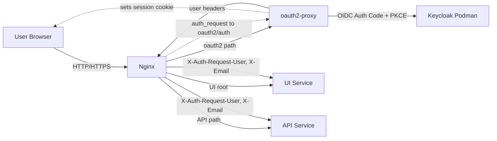

## Auth Architecture (Keycloak + oauth2-proxy + Nginx)

Description:
This setup keeps API/UI changes minimal by centralizing authentication in oauth2-proxy and Nginx.
Nginx delegates login to oauth2-proxy, which authenticates users via Keycloak (OIDC) and sets a session cookie.
Protected UI and API routes are gated by `auth_request`, and identity is forwarded to services via
`X-Auth-Request-User` and `X-Email` headers.
Only Nginx should be exposed publicly; API/UI should be private to the network.

Gradual implementation plan:
1. Add Keycloak container (podman) with a realm, client, and test user.
2. Add oauth2-proxy container configured to use the Keycloak OIDC issuer and client.
3. Add Nginx in front of UI/API with `auth_request` to oauth2-proxy.
4. Verify login flow and protected routes (UI root and `/api/*`).
5. Move traffic to Nginx only; lock down direct access to UI/API.
6. Optionally add header validation in API (defense in depth).
