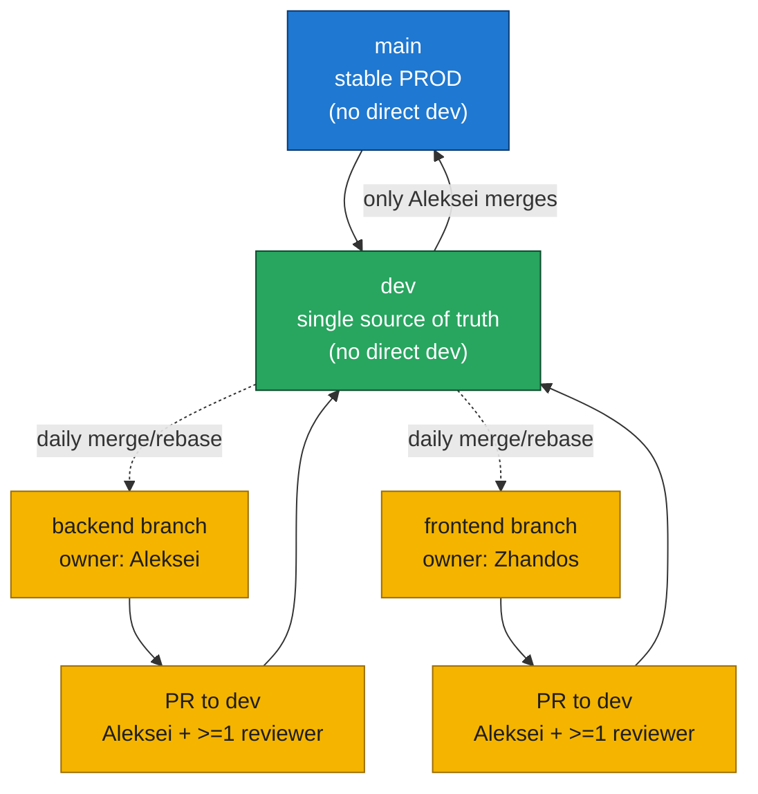

## Branching Model



## Workflow Rules
- Start work on branches off `backend` or `frontend` (no `feature/` prefix needed); no direct commits to `dev` or `main`.
- Merge or rebase feature branches with `dev` daily to avoid drift.
- Open PRs from feature branches into `dev`; approvals required: Aleksei plus at least one additional developer.
- After approval, merge into `dev`; only Aleksei promotes `dev` to `main` for PROD/investor-ready code.

## Backend env notes
- `DATABASE_URL` supports shell-style `${VAR}` expansion. Typical pattern:  
  `DATABASE_URL=postgresql+psycopg://${POSTGRES_USER}:${POSTGRES_PASSWORD}@${POSTGRES_HOST}:${POSTGRES_PORT}/${POSTGRES_DB}`
- If `DATABASE_URL` is unset, the app builds it from `POSTGRES_USER/PASSWORD/HOST/PORT/DB` env vars.
- Set `DEBUG=1` locally if you want API error details to include DB messages; keep it off in shared/dev/prod environments.

## Local dev setup
- Create a Python venv and install dev dependencies:
  ```bash
  make local-venv
  pip install -r requirements-dev.txt
  ```
- Install frontend deps:
  ```bash
  npm --prefix ui install
  npm --prefix ui_alt install
  ```
- Run tests:
  ```bash
  make test
  ```

## Lint/format
- Python:
  ```bash
  black api tests
  isort api tests
  ruff check api tests
  ```

## Pre-commit
- Install hooks:
  ```bash
  pre-commit install
  ```
- Run all hooks manually:
  ```bash
  pre-commit run --all-files
  ```

## Git How-To (feature work)
- Clone a specific feature branch locally (without full clone):  
  ```bash
  # clone repo checking out frontend branch
  git clone --branch frontend git@github.com:Veep-ORG/flow_gen2.git
  ```
- If you already cloned the repo, fetch and check out a feature branch:  
  ```bash
  # update refs
  git fetch
  # create/switch to local tracking branch for frontend
  git switch frontend   # creates local tracking branch if only found on origin
  ```
- Set or fix upstream tracking for a local feature branch:  
  ```bash
  # ensure local frontend tracks origin/frontend
  git branch --set-upstream-to=origin/frontend frontend
  ```
- Connect local work to `dev` (pull latest and rebase your branch):  
  ```bash
  # update dev from remote
  git checkout dev
  git pull
  # rebase frontend on latest dev
  git checkout frontend
  git rebase dev
  ```
- Commit your local changes (example message):  
  ```bash
  # inspect pending changes
  git status
  # stage all modifications
  git add .
  # commit with required message format
  git commit -m "zhandos: 17.12.2025: New frontend window"
  # push frontend to its upstream
  git push
  ```
