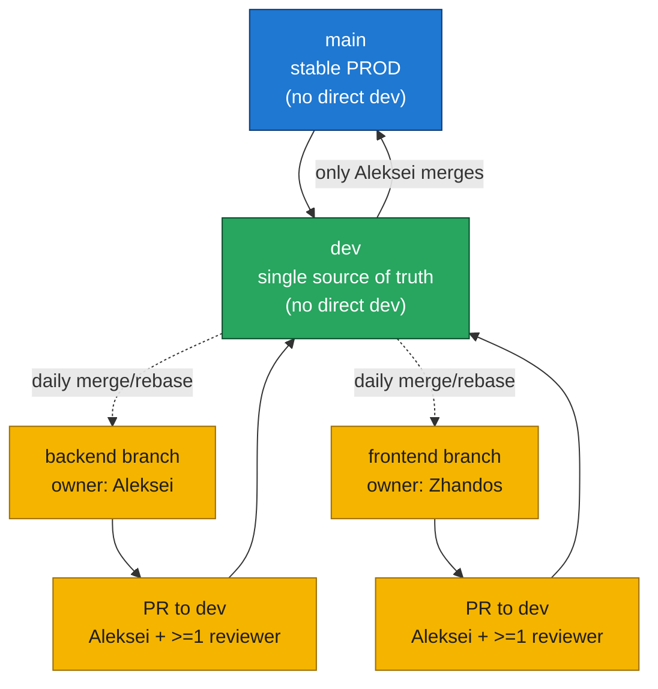

# Development Workflow

## Document Control
- Status: Approved
- Owner: Engineering Team
- Reviewers: Repository maintainers
- Created: 2026-02-06
- Last Updated: 2026-02-06
- Version: v1.1

## Purpose
Define the team development workflow, branch policy, and local setup requirements for this repository.

## Scope
- In scope:
  - Branching, PR, and promotion rules.
  - Local development environment setup and quality commands.
  - Git workflow guidance for feature development.
- Out of scope:
  - Product architecture and business behavior.
  - API endpoint specifications.

## Design / Behavior
Use the process below as the operational workflow for day-to-day development and integration.

### Branching Model



## Workflow Rules
- Start work on branches off `backend` or `frontend` (no `feature/` prefix needed); no direct commits to `dev` or `main`.
- Merge or rebase feature branches with `dev` daily to avoid drift.
- Open PRs from feature branches into `dev`; approvals required: Aleksei plus at least one additional developer.
- After approval, merge into `dev`; only Aleksei promotes `dev` to `main` for PROD/investor-ready code.

## Backend env notes
- `APP_DATABASE_URL` supports shell-style `${VAR}` expansion. Typical pattern:  
  `APP_DATABASE_URL=postgresql+psycopg://${APP_DB_USER}:${APP_DB_PASSWORD}@${POSTGRES_HOST}:${POSTGRES_PORT}/${POSTGRES_DB}`
- If `APP_DATABASE_URL` is unset, the app builds it from `APP_DB_USER/APP_DB_PASSWORD` plus `POSTGRES_HOST/PORT/DB` env vars.
- Object storage defaults to `MINIO_ENDPOINT=minio:9000` and `MINIO_BUCKET=flow-default`. Override with `MINIO_ENDPOINT`, `MINIO_BUCKET`, `MINIO_ROOT_USER`, `MINIO_ROOT_PASSWORD`, `MINIO_SECURE`. MinIO credentials (`MINIO_ROOT_USER` / `MINIO_ROOT_PASSWORD`) are required for local dev and CI.
- Upload size limit: `MAX_UPLOAD_SIZE_MB` (default 128).
- MinIO retry tuning: `MINIO_RETRIES`, `MINIO_RETRY_DELAY_SEC`.
- Set `DEBUG=1` locally if you want API error details to include DB messages; keep it off in shared/dev/prod environments.

## Local dev setup
- Keycloak logs use `.local/keycloak`. `make up` creates it automatically. If you run compose directly, create it first:
  ```bash
  mkdir -p .local/keycloak
  ```
- Compose reads environment from `.env.compose` (copy from `.env.example` as needed):
  ```bash
  cp .env.example .env.compose
  ```
- Create a Python venv and install dev dependencies:
  ```bash
  make local-venv
  pip install -r requirements-dev.txt
  ```
- Install frontend deps:
  ```bash
  npm --prefix ui install
  npm --prefix ui_alt install
  ```
- Run tests:
  ```bash
  make test
  ```

## Lint/format
- Python:
  ```bash
  black api tests
  ruff check api tests
  ```

## Pre-commit
- Install hooks:
  ```bash
  pre-commit install
  ```
- Run all hooks manually:
  ```bash
  pre-commit run --all-files
  ```

## Git How-To (feature work)
- Clone a specific feature branch locally (without full clone):  
  ```bash
  # clone repo checking out frontend branch
  git clone --branch frontend git@github.com:Veep-ORG/flow_gen2.git
  ```
- If you already cloned the repo, fetch and check out a feature branch:  
  ```bash
  # update refs
  git fetch
  # create/switch to local tracking branch for frontend
  git switch frontend   # creates local tracking branch if only found on origin
  ```
- Set or fix upstream tracking for a local feature branch:  
  ```bash
  # ensure local frontend tracks origin/frontend
  git branch --set-upstream-to=origin/frontend frontend
  ```
- Connect local work to `dev` (pull latest and rebase your branch):  
  ```bash
  # update dev from remote
  git checkout dev
  git pull
  # rebase frontend on latest dev
  git checkout frontend
  git rebase dev
  # push rebased branch to remote
git push --force-with-lease
  ```
- Commit your local changes (example message):  
  ```bash
  # inspect pending changes
  git status
  # stage all modifications
  git add .
  # commit with required message format
  git commit -m "zhandos: 17.12.2025: New frontend window"
  # push frontend to its upstream
  git push
  ```

## Edge Cases
- Local branch diverges significantly from `dev` and requires conflict resolution.
- Missing local env variables cause backend startup or test failures.
- Force-push is required after rebase and must use `--force-with-lease`.

## References
- `README.md`
- `Makefile`
- `.env.example`
