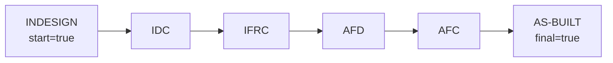

# Document Workflow

## Document Control
- Status: Approved
- Owner: Backend and Database Team
- Reviewers: API maintainers
- Created: 2026-02-06
- Last Updated: 2026-03-26
- Version: v2.6

## Change Log
- 2026-03-26 | v2.6 | Removed `revertible` and `editable` from the revision-code lifecycle model so `revision_overview` now carries only successor linkage, start/final markers, and descriptive `percentage`.
- 2026-03-25 | v2.4 | Replaced generic in-place revision-code mutation with dedicated overview-transition and supersede workflows, documented default initial `rev_code_id` resolution from `revision_overview.start`, clarified that supersede keeps the same `rev_code_id` while restarting at the workflow start status, removed the redundant public generic revision-create endpoint, and clarified that canceled revisions are hidden from standard workflow views.
- 2026-03-20 | v2.2 | Clarified the current revision-code mutation contract: `ref.revision_overview` stays reference configuration, there is no dedicated overview-transition endpoint, and the generic revision update workflow may still change `core.doc_revision.rev_code_id`; also clarified that environments are recreated from `ci/init/` rather than migrated in place, that documented revision-code safety guarantees apply to bootstrap/reseed identity preservation only, that revision-status `revertible` means immediate-predecessor rollback via reverse `next_rev_status_id`, and that every `revision_overview` row must remain on the single connected lifecycle path from the unique start step to the unique final step while matching the current SQL constraints for final-step locking, cycle/self-reference prevention, and the single-predecessor rule.
- 2026-03-19 | v1.6 | Clarified `revision_overview` path semantics, including path-derived ordering, successor nullability, and the metadata role of `revertible`, `editable`, and `percentage`.
- 2026-03-18 | v1.5 | Redesigned `revision_overview` as a lifecycle table with start/final markers, explicit next-step links, edit/revert flags, and start-to-finish flow ordering.
- 2026-02-21 | v1.4 | Corrected core-vs-dictionary table classification and added implemented collaboration entities (`written_comments`, `notifications`, `notification_targets`, `notification_recipients`) to the workflow inventory.
- 2026-02-20 | v1.2 | Added Change Log section for standards compliance

## Purpose
Describe the implemented document and revision lifecycle, including state transitions and related data model entities.

## Scope
- In scope:
  - Document and revision entities used by workflow.
  - State model, transitions, and guard conditions.
  - Related lifecycle actions such as cancel and delete.
- Out of scope:
  - Authentication and authorization architecture.
  - UI presentation behavior.

## Design / Behavior
The tables below define the expected workflow mechanics and transition semantics for document processing.

Schema ownership (implementation contract):
- `core` schema owns authoritative workflow/collaboration entities (`doc`, `doc_revision`, `files`, `files_commented`, `written_comments`, `distribution_list`, `distribution_list_content`, `notifications`, `notification_targets`, `notification_recipients`).
- `ref` schema owns lookup/reference entities (`projects`, `areas`, `units`, `roles`, `person_duty`, `person`, `users`, `permissions`, and other lookups).
- `workflow` schema exposes the API-facing contract via functions and views over `core`/`ref`.
- `audit` schema owns history/trace tables.

## Overview

| Item | Description |
| --- | --- |
| Purpose | Describe the end-to-end document workflow and its technical implementation. |
| Scope | Documents and revisions lifecycle. |
| Systems | API, DB, UI (as applicable). DB centers on `doc`, `doc_revision`, `files`, `files_commented`, `written_comments`, and notification/distribution-list collaboration tables with supporting dictionary (lookup) tables. |
| Primary Actors | Define the roles that touch the document (e.g., author, reviewer, approver, admin). |

## Tables

| Entity | Description | Fields |
| --- | --- | --- |
| Document (`doc`) | Core document record. Main workflow metadata lives here. | doc_id, doc_name_unique, title, project_id, jobpack_id, type_id, area_id, unit_id, rev_actual_id, rev_current_id, voided, created_at, updated_at, created_by, updated_by |
| Document Revision (`doc_revision`) | Per-revision record that captures state and revision metadata. | rev_id, rev_code_id, rev_author_id, rev_originator_id, as_built, superseded, transmital_current_revision, milestone_id, planned_start_date, planned_finish_date, actual_start_date, actual_finish_date, canceled_date, rev_status_id, doc_id, seq_num, rev_modifier_id, modified_doc_date, created_at, updated_at, created_by, updated_by |
| Files (`files`) | Primary file attachment linked to a revision. | id, filename, s3_uid, mimetype, rev_id, created_at, updated_at, created_by, updated_by |
| Files Commented (`files_commented`) | Comment/markup file linked to a primary file and user. | id, file_id, user_id, s3_uid, mimetype, created_at, updated_at, created_by, updated_by |
| Written Comments (`written_comments`) | Plain-text comments linked to a revision and user. | id, rev_id, user_id, comment_text, created_at, updated_at, created_by, updated_by |
| Notifications (`notifications`) | Notification master record bound to revision context with lifecycle fields (drop/replace). | notification_id, sender_user_id, event_type, title, body, remark, rev_id, commented_file_id, created_at, dropped_at, dropped_by_user_id, superseded_by_notification_id, created_by, updated_by, updated_at |
| Notification Targets (`notification_targets`) | Requested recipients per notification (direct user or distribution list). | target_id, notification_id, recipient_user_id, recipient_dist_id, created_at, updated_at, created_by, updated_by |
| Notification Recipients (`notification_recipients`) | Expanded inbox recipients with delivery/read timestamps. | notification_id, recipient_user_id, delivered_at, read_at, created_at, updated_at, created_by, updated_by |
| Dictionary (Lookup) | Reference/lookup tables are owned by `ref` and exposed via `workflow` views. Current lookup inventory: `areas`, `disciplines`, `projects`, `units`, `jobpacks`, `roles`, `doc_rev_milestones`, `revision_overview`, `doc_rev_status_ui_behaviors`, `doc_rev_statuses`, `files_accepted`, `leased_doc_nums`, `instance_parameters`, `person_duty`, `person`, `users`, `doc_types`, `permissions`, `doc_cache`. | Lookup IDs and reference data fields per table (e.g., project_id, type_id, etc.). |

## States

Revision-status rollback semantics:
- `revertible` on `doc_rev_statuses` controls only backward status transitions.
- A backward transition moves to the unique immediate predecessor status whose `next_rev_status_id` points to the current status.
- The start status has no predecessor and cannot move backward.
- The status graph allows at most one predecessor per status, so backward transitions are never ambiguous.

| State | Description | Entry Criteria | Exit Criteria | Guards |
| --- | --- | --- | --- | --- |
| Draft | Initially created document: a new revision is created automatically with status where `start=TRUE` in `doc_rev_statuses`. `rev_current_id` is filled. Document has no files initially; files can be added to the draft revision. Originator and modifier are the users who create the document. | Document is created and initial revision is auto-created. | Revision is transferred by a user to the Intermediate state. | Files are optional in Draft. Only one revision per document can be in Draft or Intermediate at a time. |
| Intermediate | Other users can add comments to the revision and to files (a copy of files is created). | Review/commenting is enabled for the revision. | Commenting completes or the revision proceeds to the next state. | Files must be attached before entering Intermediate. Only one revision per document can be in Draft or Intermediate at a time. |
| Final | Revision becomes “actual”; `rev_actual_id = rev_current_id`. Status is the one where `final=TRUE` in `doc_rev_statuses`. | Revision is approved for finalization. | A new draft revision may be created from the current final revision through overview transition. | Multiple final revisions may coexist per document only when their `rev_code_id` values differ. |

## Revision code lifecycle (`revision_overview`)

`revision_overview` is no longer a flat legend. It is a lifecycle table that mirrors the same data-driven pattern used by `doc_rev_statuses`:

- exactly one step has `start = TRUE`
- exactly one step has `final = TRUE`
- each non-final step points to its immediate successor through `next_rev_code_id`
- each non-terminal step can have at most one predecessor; the lifecycle is a single chain rather than a branching graph
- the lifecycle path exposed by `GET /api/v1/documents/revision_overview` starts at `start = TRUE` and follows `next_rev_code_id` until the single terminal step; the API does not sort this list by name, ID, or percentage
- every stored row must be reachable from that unique `start = TRUE` path; disconnected predecessors, unreachable nodes, and separate acyclic islands are invalid
- `percentage` is descriptive progress metadata and is not used to compute lifecycle ordering
- database constraints reject self-reference and cycles in the configured chain
- final steps are terminal by definition: when `final = TRUE`, `next_rev_code_id IS NULL`
- connectivity is checked at transaction end so multi-step reconfiguration may be staged within one transaction, but the committed end state must still be one connected start-to-final path
- current repository behavior exposes a dedicated `POST /api/v1/documents/revisions/{rev_id}/overview-transition` action for creating the next revision from a current final revision
- current repository behavior exposes a dedicated `POST /api/v1/documents/revisions/{rev_id}/supersede` action for replacing the current non-final revision while keeping the same `rev_code_id`
- generic revision updates cannot change `core.doc_revision.rev_code_id` after creation
- brand new document creation defaults the initial revision `rev_code_id` to the unique `revision_overview.start = TRUE` step when the client omits `rev_code_id`

Bootstrap and migration notes:
- Repository bootstrap currently relies on `ci/init/flow_init.psql` followed by `ci/init/flow_seed.sql`.
- For now, database changes are applied by dropping and recreating the database from `ci/init/`; the repository does not ship in-place revision-code migration scripts.
- The seeded lifecycle intentionally uses stable explicit IDs so downstream references remain predictable:
  - `1 = IDC`
  - `2 = IFRC`
  - `3 = AFD`
  - `4 = AFC`
  - `5 = AS-BUILT`
  - `6 = INDESIGN`
- `flow_seed.sql` resets the `rev_code_id` identity sequence after inserting those explicit rows so new generated IDs continue above the seeded range.
- If a future migration framework is introduced, any in-place migration must preserve those IDs or update all dependent references in the same migration.

| Step | Acronym | Next Step | Start | Final |
| --- | --- | --- | --- | --- |
| INDESIGN | A | IDC | Yes | No |
| IDC | B | IFRC | No | No |
| IFRC | C | AFD | No | No |
| AFD | D | AFC | No | No |
| AFC | E | AS-BUILT | No | No |
| AS-BUILT | Z | — | No | Yes |

## Transitions

| From State | To State | Trigger | Actor | API/Service | DB Changes | Notes |
| --- | --- | --- | --- | --- | --- | --- |
| Draft | Intermediate | User transfers the revision to Intermediate; files must be attached. | Author or system on submission. | `/api/v1/documents/revisions/{rev_id}/status-transitions` | Update revision status and related timestamps; keep doc pointers unchanged. | Intermediate enables commenting on revision and files. |
| Intermediate | Draft | Revision is reverted back to Draft. | Author or system. | `/api/v1/documents/revisions/{rev_id}/status-transitions` | Update revision status; keep doc pointers unchanged. | Used when commenting/review is stopped or needs rework. |
| Draft or Intermediate | Draft | Current non-final revision is replaced in workflow history. | Author or system. | `/api/v1/documents/revisions/{rev_id}/supersede` | Mark source revision `superseded=true`; insert replacement revision with the same `rev_code_id`; set `rev_current_id` to the replacement. | The replacement revision always restarts at the workflow start status. |
| Intermediate | Final | Commenting completes and revision is approved for finalization. | Reviewer/approver. | `/api/v1/documents/revisions/{rev_id}/status-transitions` | Update revision status; set `rev_actual_id=rev_current_id` to this revision. | Final makes the revision “actual/current” without superseding other final revisions that have different `rev_code_id`. |
| Final | Draft | A new revision is created from the current final revision using the next allowed revision-overview step. | Author or system. | `/api/v1/documents/revisions/{rev_id}/overview-transition` | Insert new revision; keep the source final revision unchanged; set `rev_actual_id` to the source final revision and `rev_current_id` to the new revision. | The new revision starts at the workflow start status and receives its `rev_code_id` from `revision_overview.next_rev_code_id`. |

Revision-code change behavior:
- `POST /api/v1/documents/revisions/{rev_id}/overview-transition` is the supported way to create the next revision from a current final revision.
- `POST /api/v1/documents/revisions/{rev_id}/supersede` is the supported way to replace the current non-final revision while keeping the same `rev_code_id`.
- There is no public `POST /api/v1/documents/{doc_id}/revisions` endpoint for follow-up revisions.
- `core.doc_revision.rev_code_id` cannot be changed through the generic revision update workflow (`PUT /api/v1/documents/revisions/{rev_id}`).
- The overview-transition action resolves the target `rev_code_id` from `ref.revision_overview`; it does not mutate `ref.revision_overview`.
- Multiple historical revisions may reuse the same `rev_code_id` only after earlier revisions with that code have been canceled or superseded.

## Other Actions

| Action | Description |
| --- | --- |
| Deletion of Document | Physical deletion in DB is allowed only if the document has 0 revisions whose status has `final=TRUE` in `doc_rev_statuses`. Otherwise document can only be voided. |
| Deletion of Revision | Revisions can be deleted only with document deletion (see document deletion rule). Otherwise the revision is set to "Canceled". Cancelation is allowed only for Draft or Intermediate revisions. When canceled, set `rev_current_id = rev_actual_id` (previous actual) and hide the canceled revision from standard workflow list views. |

## Edge Cases
- Transition request sent when required file attachments are missing.
- Concurrent transition attempts on the same revision.
- Delete requested for documents with final revisions where only voiding is allowed.

## References
- `documentation/api_db_rules.md`
- `documentation/api_interfaces.md`
- `api/routers/documents.py`
