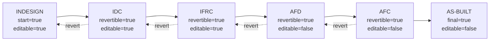

# Document Workflow

## Document Control
- Status: Approved
- Owner: Backend and Database Team
- Reviewers: API maintainers
- Created: 2026-02-06
- Last Updated: 2026-03-18
- Version: v1.5

## Change Log
- 2026-03-18 | v1.5 | Redesigned `revision_overview` as a lifecycle table with start/final markers, explicit next-step links, edit/revert flags, and start-to-finish flow ordering.
- 2026-02-21 | v1.4 | Corrected core-vs-dictionary table classification and added implemented collaboration entities (`written_comments`, `notifications`, `notification_targets`, `notification_recipients`) to the workflow inventory.
- 2026-02-20 | v1.2 | Added Change Log section for standards compliance

## Purpose
Describe the implemented document and revision lifecycle, including state transitions and related data model entities.

## Scope
- In scope:
  - Document and revision entities used by workflow.
  - State model, transitions, and guard conditions.
  - Related lifecycle actions such as cancel and delete.
- Out of scope:
  - Authentication and authorization architecture.
  - UI presentation behavior.

## Design / Behavior
The tables below define the expected workflow mechanics and transition semantics for document processing.

Schema ownership (implementation contract):
- `core` schema owns authoritative workflow/collaboration entities (`doc`, `doc_revision`, `files`, `files_commented`, `written_comments`, `distribution_list`, `distribution_list_content`, `notifications`, `notification_targets`, `notification_recipients`).
- `ref` schema owns lookup/reference entities (`projects`, `areas`, `units`, `roles`, `person_duty`, `person`, `users`, `permissions`, and other lookups).
- `workflow` schema exposes the API-facing contract via functions and views over `core`/`ref`.
- `audit` schema owns history/trace tables.

## Overview

| Item | Description |
| --- | --- |
| Purpose | Describe the end-to-end document workflow and its technical implementation. |
| Scope | Documents and revisions lifecycle. |
| Systems | API, DB, UI (as applicable). DB centers on `doc`, `doc_revision`, `files`, `files_commented`, `written_comments`, and notification/distribution-list collaboration tables with supporting dictionary (lookup) tables. |
| Primary Actors | Define the roles that touch the document (e.g., author, reviewer, approver, admin). |

## Tables

| Entity | Description | Fields |
| --- | --- | --- |
| Document (`doc`) | Core document record. Main workflow metadata lives here. | doc_id, doc_name_unique, title, project_id, jobpack_id, type_id, area_id, unit_id, rev_actual_id, rev_current_id, voided, created_at, updated_at, created_by, updated_by |
| Document Revision (`doc_revision`) | Per-revision record that captures state and revision metadata. | rev_id, rev_code_id, rev_author_id, rev_originator_id, as_built, superseded, transmital_current_revision, milestone_id, planned_start_date, planned_finish_date, actual_start_date, actual_finish_date, canceled_date, rev_status_id, doc_id, seq_num, rev_modifier_id, modified_doc_date, created_at, updated_at, created_by, updated_by |
| Files (`files`) | Primary file attachment linked to a revision. | id, filename, s3_uid, mimetype, rev_id, created_at, updated_at, created_by, updated_by |
| Files Commented (`files_commented`) | Comment/markup file linked to a primary file and user. | id, file_id, user_id, s3_uid, mimetype, created_at, updated_at, created_by, updated_by |
| Written Comments (`written_comments`) | Plain-text comments linked to a revision and user. | id, rev_id, user_id, comment_text, created_at, updated_at, created_by, updated_by |
| Notifications (`notifications`) | Notification master record bound to revision context with lifecycle fields (drop/replace). | notification_id, sender_user_id, event_type, title, body, remark, rev_id, commented_file_id, created_at, dropped_at, dropped_by_user_id, superseded_by_notification_id, created_by, updated_by, updated_at |
| Notification Targets (`notification_targets`) | Requested recipients per notification (direct user or distribution list). | target_id, notification_id, recipient_user_id, recipient_dist_id, created_at, updated_at, created_by, updated_by |
| Notification Recipients (`notification_recipients`) | Expanded inbox recipients with delivery/read timestamps. | notification_id, recipient_user_id, delivered_at, read_at, created_at, updated_at, created_by, updated_by |
| Dictionary (Lookup) | Reference/lookup tables are owned by `ref` and exposed via `workflow` views. Current lookup inventory: `areas`, `disciplines`, `projects`, `units`, `jobpacks`, `roles`, `doc_rev_milestones`, `revision_overview`, `doc_rev_status_ui_behaviors`, `doc_rev_statuses`, `files_accepted`, `leased_doc_nums`, `instance_parameters`, `person_duty`, `person`, `users`, `doc_types`, `permissions`, `doc_cache`. | Lookup IDs and reference data fields per table (e.g., project_id, type_id, etc.). |

## States

| State | Description | Entry Criteria | Exit Criteria | Guards |
| --- | --- | --- | --- | --- |
| Draft | Initially created document: a new revision is created automatically with status where `start=TRUE` in `doc_rev_statuses`. `rev_current_id` is filled. Document has no files initially; files can be added to the draft revision. Originator and modifier are the users who create the document. | Document is created and initial revision is auto-created. | Revision is transferred by a user to the Intermediate state. | Files are optional in Draft. Only one revision per document can be in Draft or Intermediate at a time. |
| Intermediate | Other users can add comments to the revision and to files (a copy of files is created). | Review/commenting is enabled for the revision. | Commenting completes or the revision proceeds to the next state. | Files must be attached before entering Intermediate. Only one revision per document can be in Draft or Intermediate at a time. |
| Final | Revision becomes “actual”; `rev_actual_id = rev_current_id`. Status is the one where `final=TRUE` in `doc_rev_statuses`. | Revision is approved for finalization. | Revision is superseded by a new revision coming from the Intermediate state. | Only one revision per document can be Final (not superseded). |

## Revision code lifecycle (`revision_overview`)

`revision_overview` is no longer a flat legend. It is a lifecycle table that mirrors the same data-driven pattern used by `doc_rev_statuses`:

- exactly one step has `start = TRUE`
- exactly one step has `final = TRUE`
- each non-final step points to `next_rev_code_id`
- backward movement is allowed only when `revertible = TRUE`
- editing is allowed only when `editable = TRUE`

| Step | Acronym | Next Step | Can revert to previous | Editable | Start | Final |
| --- | --- | --- | --- | --- | --- | --- |
| INDESIGN | A | IDC | No | Yes | Yes | No |
| IDC | B | IFRC | Yes | Yes | No | No |
| IFRC | C | AFD | Yes | Yes | No | No |
| AFD | D | AFC | Yes | No | No | No |
| AFC | E | AS-BUILT | Yes | No | No | No |
| AS-BUILT | Z | — | No | No | No | Yes |

## Transitions

| From State | To State | Trigger | Actor | API/Service | DB Changes | Notes |
| --- | --- | --- | --- | --- | --- | --- |
| Draft | Intermediate | User transfers the revision to Intermediate; files must be attached. | Author or system on submission. | `/api/v1/documents/revisions/{rev_id}/status-transitions` | Update revision status and related timestamps; keep doc pointers unchanged. | Intermediate enables commenting on revision and files. |
| Intermediate | Draft | Revision is reverted back to Draft. | Author or system. | `/api/v1/documents/revisions/{rev_id}/status-transitions` | Update revision status; keep doc pointers unchanged. | Used when commenting/review is stopped or needs rework. |
| Intermediate | Final | Commenting completes and revision is approved for finalization. | Reviewer/approver. | `/api/v1/documents/revisions/{rev_id}/status-transitions` | Update revision status; set `rev_actual_id=rev_current_id` to this revision. | Final makes the revision “actual/current”. |
| Final | Intermediate | A new revision is created and moved into Intermediate, superseding the final revision. | Author or system. | `/api/v1/documents/revisions/{rev_id}/status-transitions` | Insert new revision; mark prior as superseded; update pointers when new final is set. | Superseded. |

## Other Actions

| Action | Description |
| --- | --- |
| Deletion of Document | Physical deletion in DB is allowed only if the document has 0 revisions whose status has `final=TRUE` in `doc_rev_statuses`. Otherwise document can only be voided. |
| Deletion of Revision | Revisions can be deleted only with document deletion (see document deletion rule). Otherwise the revision is set to "Canceled". Cancelation is allowed only for Draft or Intermediate revisions. When canceled, set `rev_current_id = rev_actual_id` (previous actual). |

## Edge Cases
- Transition request sent when required file attachments are missing.
- Concurrent transition attempts on the same revision.
- Delete requested for documents with final revisions where only voiding is allowed.

## References
- `documentation/api_db_rules.md`
- `documentation/api_interfaces.md`
- `api/routers/documents.py`
