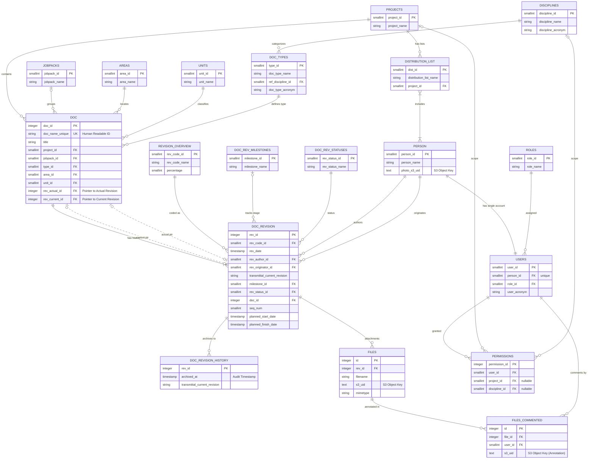

```mermaid
erDiagram
    %% ==========================================
    %% 1. Core Documentation Entities
    %% ==========================================
    DOC {
        integer doc_id PK
        string doc_name_unique UK "Human Readable ID"
        string title
        smallint project_id FK
        smallint jobpack_id FK
        smallint type_id FK
        smallint area_id FK
        smallint unit_id FK
        integer rev_actual_id FK "Pointer to Actual Revision"
        integer rev_current_id FK "Pointer to Current Revision"
    }

    DOC_REVISION {
        integer rev_id PK
        smallint rev_code_id FK
        timestamp rev_date
        smallint rev_author_id FK
        smallint rev_originator_id FK
        string transmittal_current_revision
        smallint milestone_id FK
        smallint rev_status_id FK
        integer doc_id FK
        smallint seq_num
        timestamp planned_start_date
        timestamp planned_finish_date
    }

    DOC_REVISION_HISTORY {
        integer rev_id PK
        timestamp archived_at "Audit Timestamp"
        string transmittal_current_revision
        %% Stores snapshot of previous states
    }

    FILES {
        integer id PK
        integer rev_id FK
        string filename
        text s3_uid "S3 Object Key"
        string mimetype
    }

    FILES_COMMENTED {
        integer id PK
        integer file_id FK
        smallint user_id FK
        text s3_uid "S3 Object Key (Annotation)"
    }

    %% ==========================================
    %% 2. Lookup / Reference Tables
    %% ==========================================
    PROJECTS { smallint project_id PK string project_name }
    JOBPACKS { smallint jobpack_id PK string jobpack_name }
    AREAS { smallint area_id PK string area_name }
    UNITS { smallint unit_id PK string unit_name }
    
    DOC_TYPES { 
        smallint type_id PK 
        string doc_type_name 
        smallint ref_discipline_id FK
        string doc_type_acronym
    }
    
    DISCIPLINES { 
        smallint discipline_id PK 
        string discipline_name 
        string discipline_acronym
    }
    
    REVISION_OVERVIEW { 
        smallint rev_code_id PK 
        string rev_code_name 
        smallint percentage
    }
    
    DOC_REV_MILESTONES { smallint milestone_id PK string milestone_name }
    DOC_REV_STATUSES { smallint rev_status_id PK string rev_status_name }

    %% ==========================================
    %% 3. User & Permissions
    %% ==========================================
    PERSON { 
        smallint person_id PK 
        string person_name 
        text photo_s3_uid "S3 Object Key"
    }

    USERS { 
        smallint user_id PK 
        smallint person_id FK "unique"
        smallint role_id FK
        string user_acronym
    }

    ROLES { smallint role_id PK string role_name }
    
    PERMISSIONS {
        integer permission_id PK
        smallint user_id FK
        smallint project_id FK "nullable"
        smallint discipline_id FK "nullable"
    }

    DISTRIBUTION_LIST {
        smallint dist_id PK
        string distribution_list_name
        smallint project_id FK
    }

    %% ==========================================
    %% 4. Relationships
    %% ==========================================

    %% Doc References
    PROJECTS ||--o{ DOC : "contains"
    JOBPACKS |o--o{ DOC : "groups"
    AREAS ||--o{ DOC : "locates"
    UNITS ||--o{ DOC : "classifies"
    DOC_TYPES ||--o{ DOC : "defines type"
    
    %% Doc Type Hierarchy
    DISCIPLINES ||--o{ DOC_TYPES : "categorizes"

    %% Doc to Revision (Circular)
    DOC ||--|{ DOC_REVISION : "has history"
    DOC |o..o| DOC_REVISION : "current ptr"
    DOC |o..o| DOC_REVISION : "actual ptr"

    %% Revision Audit
    DOC_REVISION ||--o{ DOC_REVISION_HISTORY : "archives to"

    %% Revision Details
    REVISION_OVERVIEW ||--o{ DOC_REVISION : "coded as"
    DOC_REV_MILESTONES |o--o{ DOC_REVISION : "tracks stage"
    DOC_REV_STATUSES ||--o{ DOC_REVISION : "status"
    
    %% Authorship
    PERSON ||--o{ DOC_REVISION : "authors"
    PERSON ||--o{ DOC_REVISION : "originates"

    %% Files
    DOC_REVISION ||--o{ FILES : "attachments"
    FILES ||--o{ FILES_COMMENTED : "annotated in"
    
    %% User Management
    PERSON ||--|| USERS : "has single account"
    ROLES ||--o{ USERS : "assigned"
    USERS ||--o{ FILES_COMMENTED : "comments by"
    
    %% Permissions
    USERS ||--o{ PERMISSIONS : "granted"
    PROJECTS |o--o{ PERMISSIONS : "scope"
    DISCIPLINES |o--o{ PERMISSIONS : "scope"

    %% Distribution Lists
    PROJECTS ||--o{ DISTRIBUTION_LIST : "has lists"
    DISTRIBUTION_LIST }|--|{ PERSON : "includes"

```

