# ER Diagram

## Document Control
- Status: Approved
- Owner: Backend and Database Team
- Reviewers: API maintainers
- Created: 2026-02-06
- Last Updated: 2026-02-21
- Version: v1.4

## Change Log
- 2026-02-21 | v1.4 | Synchronized ER model with current schema for distribution lists (`doc_id`, `user_id` membership), person duty fields (`person_duty`, `person.duty_id`, `person.email`), and implemented collaboration entities (`written_comments`, `notifications`, `notification_targets`, `notification_recipients`).
- 2026-02-20 | v1.2 | Added Change Log section for standards compliance

## Purpose
Provide an entity-relationship view of core workflow, lookup, user, permissions, and distribution list data structures.

## Scope
- In scope:
  - Logical entities and key relationships represented in the ER diagram.
  - Core and supporting data domains used by the application.
- Out of scope:
  - Full physical DDL definitions and indexing strategy.
  - API endpoint behavior.

## Design / Behavior
The Mermaid ER diagram below is the canonical visual model for entity linkage at documentation level.

Schema ownership legend:
- Diagram entity names are logical and map to physical tables/views by schema.
- `core` owns workflow entities and notification/distribution list transactional data.
- `ref` owns lookup/reference entities including user/role/permission dictionaries.
- `workflow` provides API-facing views/functions over `core` and `ref`.
- `audit` owns historical trace entities (for example revision history tables).

```mermaid
erDiagram
    %% ==========================================
    %% 1. Core Documentation Entities
    %% ==========================================
    DOC {
        integer doc_id PK
        string doc_name_unique UK "Human Readable ID"
        string title
        smallint project_id FK
        smallint jobpack_id FK
        smallint type_id FK
        smallint area_id FK
        smallint unit_id FK
        integer rev_actual_id FK "Pointer to Actual Revision"
        integer rev_current_id FK "Pointer to Current Revision"
        boolean voided
        timestamptz created_at
        timestamptz updated_at
        smallint created_by FK
        smallint updated_by FK
    }

    DOC_REVISION {
        integer rev_id PK
        smallint rev_code_id FK
        smallint rev_author_id FK
        smallint rev_originator_id FK
        boolean as_built
        boolean superseded
        string transmital_current_revision
        smallint milestone_id FK
        timestamptz planned_start_date
        timestamptz planned_finish_date
        timestamptz actual_start_date
        timestamptz actual_finish_date
        timestamptz canceled_date
        smallint rev_status_id FK
        integer doc_id FK
        smallint seq_num
        smallint rev_modifier_id FK "NOT NULL"
        timestamptz modified_doc_date
        timestamptz created_at
        timestamptz updated_at
        smallint created_by FK
        smallint updated_by FK
    }

    DOC_REVISION_HISTORY {
        integer rev_id PK
        timestamptz archived_at "Audit Timestamp"
        smallint rev_code_id
        timestamptz rev_date
        smallint rev_author_id
        smallint rev_originator_id
        boolean as_built
        boolean superseded
        string transmital_current_revision
        smallint milestone_id
        timestamptz planned_start_date
        timestamptz planned_finish_date
        timestamptz actual_start_date
        timestamptz actual_finish_date
        timestamptz canceled_date
        smallint rev_status_id
        integer doc_id
        smallint seq_num
    }

    DOC_REVISION_HISTORY_VIEW {
        integer rev_id PK
        smallint seq_num PK
        string source_type PK
        smallint rev_code_id
        timestamptz rev_date
        smallint rev_author_id
        smallint rev_originator_id
        boolean as_built
        boolean superseded
        string transmital_current_revision
        smallint milestone_id
        timestamptz planned_start_date
        timestamptz planned_finish_date
        timestamptz actual_start_date
        timestamptz actual_finish_date
        timestamptz canceled_date
        smallint rev_status_id
        integer doc_id
    }

    FILES {
        integer id PK
        integer rev_id FK
        string filename
        text s3_uid "S3 Object Key"
        string mimetype
        timestamptz created_at
        timestamptz updated_at
        smallint created_by FK
        smallint updated_by FK
    }

    FILES_COMMENTED {
        integer id PK
        integer file_id FK
        smallint user_id FK
        text s3_uid "S3 Object Key (Annotation)"
        string mimetype
        timestamptz created_at
        timestamptz updated_at
        smallint created_by FK
        smallint updated_by FK
    }

    WRITTEN_COMMENTS {
        integer id PK
        integer rev_id FK
        smallint user_id FK
        text comment_text
        timestamptz created_at
        timestamptz updated_at
        smallint created_by FK
        smallint updated_by FK
    }

    NOTIFICATIONS {
        integer notification_id PK
        smallint sender_user_id FK
        string event_type
        string title
        text body
        text remark
        integer rev_id FK
        integer commented_file_id FK "nullable"
        timestamptz created_at
        timestamptz dropped_at "nullable"
        smallint dropped_by_user_id FK "nullable"
        integer superseded_by_notification_id FK "nullable"
    }

    NOTIFICATION_TARGETS {
        bigint target_id PK
        integer notification_id FK
        smallint recipient_user_id FK "nullable"
        smallint recipient_dist_id FK "nullable"
    }

    NOTIFICATION_RECIPIENTS {
        integer notification_id PK
        smallint recipient_user_id PK
        timestamptz delivered_at
        timestamptz read_at "nullable"
    }

    FILES_ACCEPTED {
        string file_type PK
        string mimetype
    }

    LEASED_DOC_NUMS {
        string doc_number PK
        timestamptz created_date
    }

    SQL_QUERIES {
        smallint id PK
        string query
        string titles
        string project_filtered_field
        string discipline_filtered_field
    }

    %% ==========================================
    %% 2. Lookup / Reference Tables
    %% ==========================================
    PROJECTS { smallint project_id PK string project_name }
    JOBPACKS { smallint jobpack_id PK string jobpack_name }
    AREAS { smallint area_id PK string area_name }
    UNITS { smallint unit_id PK string unit_name }
    
    DOC_TYPES { 
        smallint type_id PK 
        string doc_type_name 
        smallint ref_discipline_id FK
        string doc_type_acronym
    }
    
    DISCIPLINES { 
        smallint discipline_id PK 
        string discipline_name 
        string discipline_acronym
    }
    
    REVISION_OVERVIEW { 
        smallint rev_code_id PK 
        string rev_code_name 
        string rev_code_acronym
        string rev_description
        smallint percentage
    }
    
    DOC_REV_MILESTONES { smallint milestone_id PK string milestone_name }
    DOC_REV_STATUSES { smallint rev_status_id PK string rev_status_name }

    %% ==========================================
    %% 3. User & Permissions
    %% ==========================================
    PERSON_DUTY {
        smallint duty_id PK
        string duty_name
    }

    PERSON { 
        smallint person_id PK 
        string person_name 
        text photo_s3_uid "S3 Object Key"
        string email
        smallint duty_id FK
    }

    USERS { 
        smallint user_id PK 
        smallint person_id FK "unique"
        smallint role_id FK
        string user_acronym
    }

    ROLES { smallint role_id PK string role_name }
    
    PERMISSIONS {
        integer permission_id PK
        smallint user_id FK
        smallint project_id FK "nullable"
        smallint discipline_id FK "nullable"
    }

    DISTRIBUTION_LIST {
        smallint dist_id PK
        string distribution_list_name
        integer doc_id FK "nullable"
    }

    DISTRIBUTION_LIST_CONTENT {
        smallint dist_id PK
        smallint user_id PK
    }

    DOC_CACHE {
        smallint user_id PK
        smallint project_id PK
        string doc_name_unique PK
        string title
        smallint jobpack_id FK
        smallint type_id FK
        smallint area_id FK
        smallint unit_id FK
    }

    %% ==========================================
    %% 4. Relationships
    %% ==========================================

    %% Doc References
    PROJECTS ||--o{ DOC : "contains"
    JOBPACKS |o--o{ DOC : "groups"
    AREAS ||--o{ DOC : "locates"
    UNITS ||--o{ DOC : "classifies"
    DOC_TYPES ||--o{ DOC : "defines type"
    
    %% Doc Type Hierarchy
    DISCIPLINES ||--o{ DOC_TYPES : "categorizes"

    %% Doc to Revision (Circular)
    DOC ||--|{ DOC_REVISION : "has history"
    DOC |o..o| DOC_REVISION : "current ptr"
    DOC |o..o| DOC_REVISION : "actual ptr"

    %% Revision Audit
    DOC_REVISION ||--o{ DOC_REVISION_HISTORY : "archives to"
    DOC_REVISION ||--o{ DOC_REVISION_HISTORY_VIEW : "history view"

    %% Revision Details
    REVISION_OVERVIEW ||--o{ DOC_REVISION : "coded as"
    DOC_REV_MILESTONES |o--o{ DOC_REVISION : "tracks stage"
    DOC_REV_STATUSES ||--o{ DOC_REVISION : "status"
    
    %% Authorship
    PERSON ||--o{ DOC_REVISION : "authors"
    PERSON ||--o{ DOC_REVISION : "originates"

    %% Files
    DOC_REVISION ||--o{ FILES : "attachments"
    FILES ||--o{ FILES_COMMENTED : "annotated in"
    DOC_REVISION ||--o{ WRITTEN_COMMENTS : "written comments"
    USERS ||--o{ WRITTEN_COMMENTS : "writes"
    FILES_ACCEPTED }o--|| FILES : "allowed mimetype"
    
    %% User Management
    PERSON_DUTY ||--o{ PERSON : "classifies"
    PERSON ||--|| USERS : "has single account"
    ROLES ||--o{ USERS : "assigned"
    USERS ||--o{ FILES_COMMENTED : "comments by"
    
    %% Permissions
    USERS ||--o{ PERMISSIONS : "granted"
    PROJECTS |o--o{ PERMISSIONS : "scope"
    DISCIPLINES |o--o{ PERMISSIONS : "scope"

    %% Distribution Lists
    DOC |o--o{ DISTRIBUTION_LIST : "linked list"
    DISTRIBUTION_LIST ||--o{ DISTRIBUTION_LIST_CONTENT : "has members"
    USERS ||--o{ DISTRIBUTION_LIST_CONTENT : "included in"

    %% Notifications
    USERS ||--o{ NOTIFICATIONS : "sends"
    USERS |o--o{ NOTIFICATIONS : "drops"
    DOC_REVISION ||--o{ NOTIFICATIONS : "context revision"
    FILES_COMMENTED |o--o{ NOTIFICATIONS : "context commented file"
    NOTIFICATIONS ||--o{ NOTIFICATION_TARGETS : "targets"
    USERS |o--o{ NOTIFICATION_TARGETS : "direct target"
    DISTRIBUTION_LIST |o--o{ NOTIFICATION_TARGETS : "list target"
    NOTIFICATIONS ||--o{ NOTIFICATION_RECIPIENTS : "delivers to"
    USERS ||--o{ NOTIFICATION_RECIPIENTS : "recipient"
    NOTIFICATIONS |o--o| NOTIFICATIONS : "supersedes"

    %% Cache
    USERS ||--o{ DOC_CACHE : "cached"
    PROJECTS ||--o{ DOC_CACHE : "cached"
    JOBPACKS ||--o{ DOC_CACHE : "cached"
    DOC_TYPES ||--o{ DOC_CACHE : "cached"
    AREAS ||--o{ DOC_CACHE : "cached"
    UNITS ||--o{ DOC_CACHE : "cached"

```

## Edge Cases
- Cardinality mismatches between diagram and enforced database constraints.
- Schema updates made in code without ER diagram refresh.
- Ambiguous relationship naming for multi-scope permission entities.

## References
- `documentation/api_db_rules.md`
- `documentation/document_flow.md`
- `documentation/api_interfaces.md`
