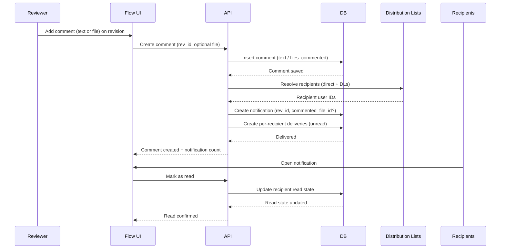

**Notifications And Distribution Lists**

**Purpose**
Define how users exchange information through notifications and distribution lists in Flow, with clear read/unread tracking and delivery rules.

**Why It Is Needed**
- The system is multi-user and requires information exchange.
- Users must be able to send messages directly or via distribution lists.
- Delivered notifications must be marked as unread.
- Reading a notification must mark it as read.

**Scope**
- User-visible notifications.
- Distribution lists and recipients.
- Read and unread state tracking.
- Delivery behavior and basic lifecycle.

**Out Of Scope**
- Real-time delivery transport details.
- Email or external push integrations.
- Full permissions model for all features.

**Core Concepts**
- **Notification**: A message created by a user or system event and delivered to one or more users.
- **Notification Linkage**: Each notification should link to a revision and optionally to a commented file
  for fast UI navigation.
- **Recipient**: A user who receives a notification.
- **Distribution List (DL)**: A named list of recipients.
- **Read State**: Per-recipient flag indicating whether the notification has been read.

**Primary Use Cases**
- User-to-user message.
- User-to-DL broadcast.
- System-to-user event notification.
- Review workflows for document revisions in intermediate statuses.

**Document Flow Integration**
- Intermediate revision statuses require review by multiple users.
- Users can leave comments that are either text or file-based (see `files_commented` table).
- All comments must be saved in the database (no hard deletes).
- Comment notifications must be delivered to recipients via direct users or DLs.
- DLs may be predefined and also adjusted by the current user.

**User And Recipient Model**
- A recipient is a user ID.
- Notification delivery is stored per recipient.
- Read state is tracked per recipient, not globally.

**Distribution Lists**
- A DL is a named collection of recipients.
- A notification can target one or more DLs.
- Recipients are resolved at send time.
- Duplicate recipients are deduplicated per notification.

**Notification Lifecycle**
1. Create a notification with sender, content, and targets.
2. Resolve recipients from direct targets and DLs.
3. Persist per-recipient delivery rows with `unread` state.
4. Users fetch their notifications with read and unread filters.
5. User marks a notification as read, changing only their delivery row.

**Read And Unread Rules**
- New deliveries default to `unread`.
- Marking read is idempotent.
- Read state is per user and does not affect other recipients.
- All notifications must be retained in the database (no hard deletes).

**Delivery Rules**
- A user must exist to receive a notification.
- If a DL contains invalid users, those entries are skipped and logged.
- If a notification targets both a user and a DL containing that user, the user receives one delivery record.
- For each notification target row, **exactly one** of `recipient_user_id` or `recipient_dist_id` is set.
- API must deduplicate recipients across direct user IDs and DL membership.

**Data Model Sketch**
- `notifications`
  - `notification_id`
  - `sender_user_id`
  - `title`
  - `body`
  - `rev_id` (required link to revision)
  - `commented_file_id` (optional link to commented file)
  - `recipient_user_id` (direct recipient, mutually exclusive with `recipient_dist_id`)
  - `recipient_dist_id` (DL recipient, mutually exclusive with `recipient_user_id`)
  - `created_at`
- `notification_recipients`
  - `notification_id`
  - `recipient_user_id`
  - `read_at` or `is_read`
  - `delivered_at`
- `distribution_list`
  - `dist_id`
  - `distribution_list_name`
  - `project_id`
- `distribution_list_content`
  - `dist_id`
  - `person_id` or `user_id`

**API Surface Sketch**
- Create notification:
  - Inputs: sender, title, body, direct user IDs, DL IDs.
  - Output: notification ID and recipient count.
- List notifications for user:
  - Filters: unread only, date range, sender.
- Mark notification read:
  - Input: notification ID.
  - Output: read state.
- List DLs and members:
  - Read-only via API if DLs are managed via seed/admin workflow.

**Behavioral Expectations**
- API should not enforce workflow rules beyond request shape and basic authorization.
- DB should enforce recipient uniqueness and write consistency.
- All updates should be transactional per notification creation.

**Open Questions**
- Are notifications immutable after creation.
- Should users be able to delete notifications or only archive.
- Should DL membership be scoped per project or global.
