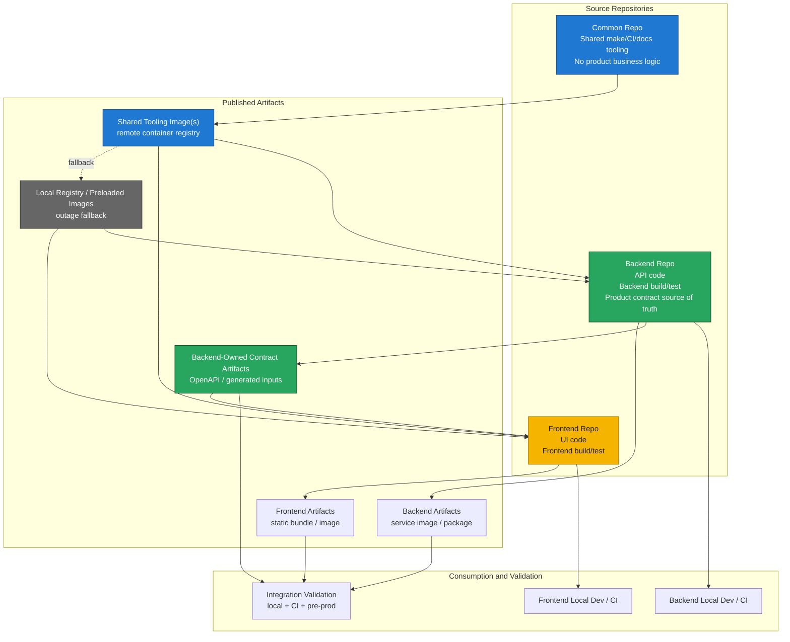
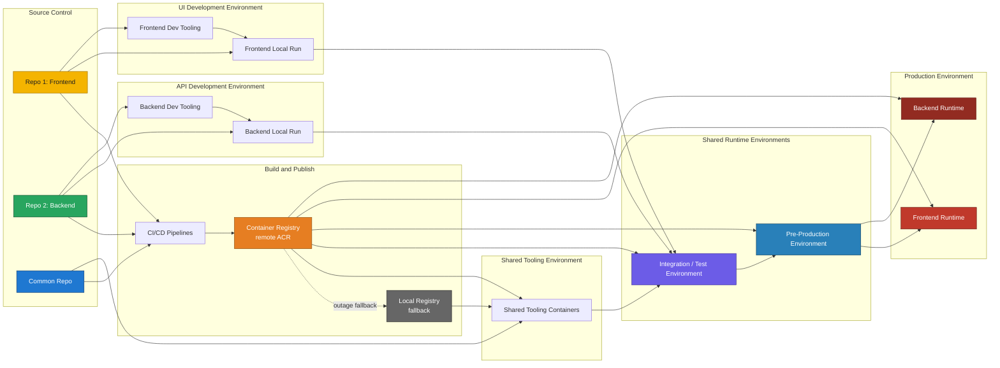

# Repository Split Technical Vision

## Document Control
- Status: Draft
- Owner: Product / Engineering
- Reviewers: Tech lead, frontend lead, backend lead, DevOps lead
- Created: 2026-04-01
- Last Updated: 2026-04-01
- Version: v0.1
- Related Tickets: TBD

## Change Log
- 2026-04-01 | v0.1 | Initial draft future-state technical vision and to-be architecture for frontend/backend repository separation.

## Purpose
Define the future-state technical vision for separating frontend and backend into independent repositories while preserving clear ownership, controlled integration, and practical delivery workflows.

## Scope
- In scope:
  - target repository topology for frontend, backend, and shared tooling
  - ownership and contract boundaries between repositories
  - artifact publication and consumption model
  - local and CI integration model after the split
  - to-be architecture diagram for the separated delivery model
- Out of scope:
  - exact migration sequence and cutover plan
  - detailed CI/CD implementation
  - branch strategy inside each future repository
  - production infrastructure changes unrelated to repository separation

## Audience
- Product owners
- Frontend engineers
- Backend engineers
- Platform / DevOps engineers
- Architecture reviewers

## Definitions
- Frontend repository: the repository that owns UI code, frontend build logic, and frontend delivery assets.
- Backend repository: the repository that owns API code, backend build logic, and backend delivery assets.
- Common repository: an optional shared repository that owns reusable tooling, shared automation, and engineering standards.
- Product contract: a frontend/backend integration contract that defines runtime behavior between product components.
- Tooling contract: a shared operational interface such as reusable `make` targets, CI helpers, or shared validation entrypoints.

## Background / Context
The approved repository-split requirements define the target operating model at policy level. A technical vision is needed so later implementation stories can align on one future-state structure instead of inventing multiple incompatible split approaches. This document translates the requirement baseline into a concrete to-be architecture view.

## Requirements
### Functional Requirements
- FR-1: The technical vision must show frontend, backend, and optional common repositories as separate delivery units with explicit ownership boundaries.
- FR-2: The technical vision must preserve backend ownership as the default source of truth for shared product contracts.
- FR-3: The technical vision must show how frontend consumes backend-owned contracts through published artifacts or documented compatibility rules instead of direct source coupling.
- FR-4: The technical vision must show how a common repository is limited to shared tooling, standards, and reusable automation.
- FR-5: The technical vision must show how shared tooling can be delivered through versioned Docker images.
- FR-6: The technical vision must show how local development remains possible when frontend and backend must run together.
- FR-7: The technical vision must show how CI validates compatibility between independently built frontend and backend artifacts.
- FR-8: The technical vision must show how shared tooling distribution can fall back to a local registry or preloaded local images when a remote registry is unavailable.

### Non-Functional Requirements
- NFR-1: The target model must reduce accidental cross-component changes by separating repositories and ownership paths.
- NFR-2: The target model should keep the common repository narrowly scoped so it does not become a hidden home for product logic.
- NFR-3: The target model must support independent versioning and release traceability for frontend, backend, and shared tooling artifacts.
- NFR-4: The target model should minimize local setup friction while avoiding direct source-level dependency between repositories.
- NFR-5: The target model must tolerate temporary remote container registry unavailability through a documented local fallback path.

## Design / Behavior
The to-be model separates product delivery into two primary repositories and one optional shared tooling repository.

Target repository roles:
- Frontend repository:
  - owns UI source code
  - owns frontend-specific build, test, and packaging logic
  - publishes frontend artifacts for deployment
  - consumes backend-owned contracts through generated or published artifacts
- Backend repository:
  - owns API and service source code
  - owns backend-specific build, test, and packaging logic
  - owns shared product contracts by default, including API schemas, auth behavior, and backend-produced event schemas
  - publishes backend deployable artifacts and contract artifacts
- Common repository:
  - owns shared `make` helpers, CI support, engineering templates, and reusable validation or generation tooling
  - publishes versioned tooling artifacts, including Docker images where useful
  - must not own business logic or serve as the default source of truth for product contracts

Contract model:
- Shared frontend/backend product contracts are backend-owned by default.
- Frontend consumes product contracts through versioned published outputs, documented compatibility rules, or generated client artifacts derived from backend-owned contracts.
- Any exception to backend ownership requires explicit architectural approval and written justification outside this baseline vision.

Artifact and tooling model:
- Frontend publishes versioned frontend build artifacts.
- Backend publishes versioned backend deployable artifacts.
- Backend may also publish contract artifacts such as API definitions or generated-client inputs.
- Common repository publishes versioned tooling artifacts and, when useful, Docker images for shared checks, code generation, and reusable CI tasks.
- Shared tooling images should normally be pulled from a remote container registry, but the operating model must support fallback to a local registry or preloaded images during remote registry outages.

Local workflow model:
- Frontend and backend must be runnable independently for repo-local work.
- When integration is needed, developers should run compatible versions of frontend and backend together through documented local composition.
- Repository-local run and debug tasks should stay inside the owning repository.
- Shared validation and generation tasks may run through common Docker-based tooling to reduce toolchain drift.

CI and compatibility model:
- Each repository validates its own quality gates independently.
- Compatibility validation should run against published or version-pinned artifacts rather than direct cross-repository source reads.
- Release promotion requires compatibility evidence from local integration workflow, CI validation, and at least one shared pre-production environment.

### To-Be Architecture Diagram

### To-Be Deployment Diagram

## Edge Cases
- Frontend needs a new API shape but backend has not yet published an updated contract artifact: integration must fail visibly instead of allowing silent source coupling.
- Shared tooling image cannot be pulled from the remote registry: local registry or preloaded-image fallback must remain usable.
- Common repository grows beyond tooling and starts accumulating product logic: ownership review must reject that drift.
- Frontend and backend release at different times: compatibility validation must confirm that the published versions still work together.
- One repository upgrades shared tooling later than the other: version pinning must allow controlled adoption without forced lockstep updates.

## Risks and Mitigations
- Risk: the common repository becomes a de facto fourth application layer with unclear product ownership.
  - Mitigation: restrict it to tooling, standards, and automation only.
- Risk: frontend starts depending on backend source internals instead of published contracts.
  - Mitigation: require versioned contract artifacts or documented compatibility rules as the integration path.
- Risk: remote registry outages block shared tooling execution.
  - Mitigation: support local registry or preloaded-image fallback for shared tooling images.
- Risk: independently released artifacts drift and fail together only late in the pipeline.
  - Mitigation: validate compatibility in local integration workflow, CI, and pre-production before promotion.

## Open Questions
- Which concrete contract artifact format should backend publish first: OpenAPI only, generated client inputs, or both?
- Should the common repository start as one Docker tooling image or multiple task-focused images?
- Which exact local composition mechanism should be standard for cross-repository integration: shared compose, wrapper targets, or another orchestrated local workflow?

## References
- `documentation/repository_split_requirements_sub_story.md`
- `documentation/repository_split_technical_vision.drawio`
- `documentation/_documentation_template.md`
- `documentation/_documentation_standards.md`
- `documentation/_documentation-index.md`
